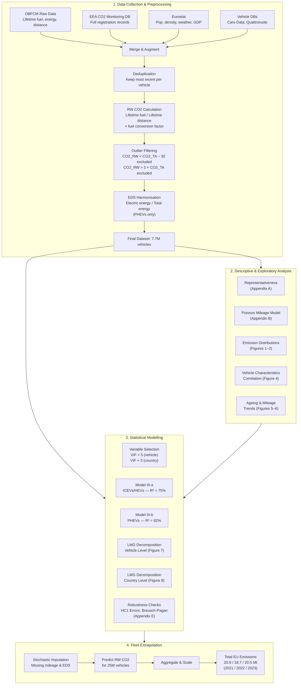
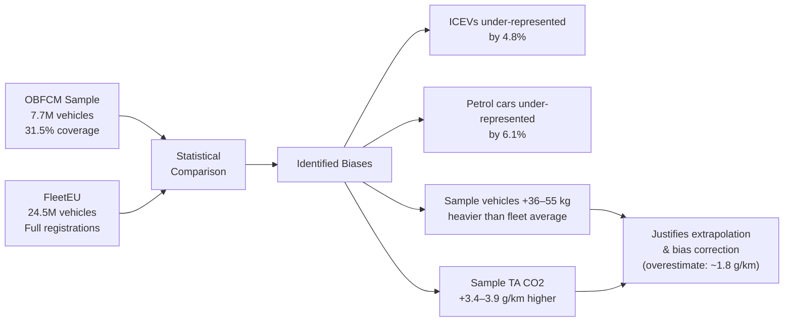
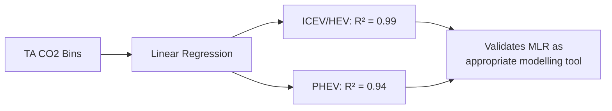
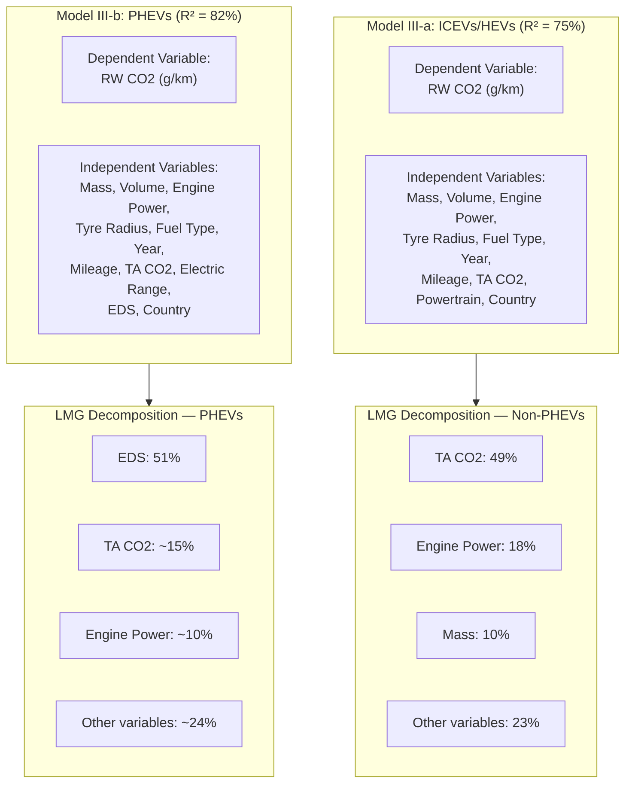
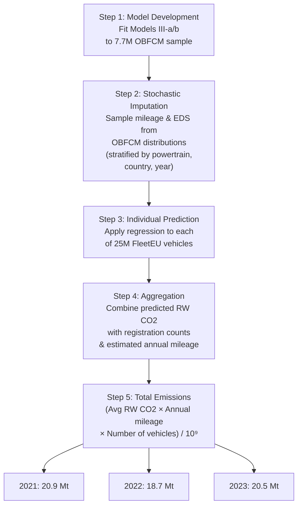

# JRC Transport Paper: Complete Analysis Breakdown

**Paper:** *Towards zero CO2 emissions: Insights from EU vehicle on-board data* — Suarez et al. (2025)

**Dataset:** 7.7 million passenger cars with OBFCM data (31.5% of 24.5M total EU registrations, 2021–2023)

---

## Overview: Analysis Pipeline

---

## 1. Representativeness Analysis (Appendix A)

**Purpose:** Validate that the 7.7M OBFCM sample adequately represents the 24.5M EU fleet.

**Method:** Comparative statistical analysis of powertrain shares, fuel types, registration years, mass, and TA CO2 between the sample and the full EEA registration dataset (FleetEU).

**Figures/Tables:** Figure A1 (map + bar charts of coverage per country), Table A1 (vehicle counts), Table A2 (mass/CO2 comparison).

**Key Findings:**
- OBFCM sample under-represents ICEVs by 4.8% and petrol cars by 6.1%
- Sample vehicles are 36–55 kg heavier on average → TA CO2 is 3–4 g/km higher
- Raw OBFCM sample overestimates RW emissions by ~1.8 g/km
- Justifies the scaling/extrapolation exercise to correct for sample biases

---

## 2. Poisson Model for Readout Timing (Appendix B)

**Purpose:** Correct bias in annual mileage estimates caused by unknown intervals between registration and OBFCM data collection.

**Method:** Poisson distribution fitted to registration dates of vehicles with 2023 readouts.

**Formula:**

$$\text{Number of vehicles} = N \times (1 - e^{-p \cdot (3 \times 365 - t)})$$

- **p** = 3.7 × 10⁻³ (constant probability of readout on a specific day)
- **R²** = 0.9

**Figure:** B1 (histogram with Poisson fitting curve), B2 (incremental distance distributions).

**Key Finding:** 2021-registered vehicles collected in 2023 provide the most stable, bias-free annual distance estimates. Validated annual distances: ~11,500 km (petrol) and ~22,700 km (diesel).

---

## 3. Descriptive Emissions Analysis (Figures 1–3)

**Purpose:** Characterise the distribution and gap between real-world (RW) and type-approval (TA) CO2 emissions.

### Figure 1 — Emission Distributions
- **Type:** Probability functions + boxplots
- **Data:** RW vs TA CO2 for ICEV, HEV, PHEV × petrol/diesel
- **Finding:** RW distributions are broader and right-skewed vs TA; PHEVs show the largest gaps (99–121 g/km) and widest spread (0–300 g/km)

### Figure 2 — Country-Specific Emissions
- **Type:** Bar chart (dark = RW, light = TA), ordered by avg. country temperature
- **Data:** Country-level average CO2 by powertrain and fuel
- **Finding:** Geographic/climate patterns in emission gaps

### Figure 3 — Annual Mileage by Country
- **Type:** Bar chart with proportional circles
- **Data:** Avg. annual mileages per country (2021 vehicles recorded in 2023, halved)

---

## 4. Vehicle Characteristic Correlation (Figure 4)

**Purpose:** Establish the linear relationship between TA ratings and RW performance.

**Method:** Linear regression and correlation analysis across TA CO2 intervals.

**Figure:** Boxplots of RW CO2 and gap as function of TA CO2 bins.

**Key Finding:** Extremely high linear correlation (R² = 0.99 ICEV/HEV, 0.94 PHEV). RW emissions increase faster than TA values for heavier/more powerful vehicles. Validates the choice of MLR modelling.

---

## 5. Vehicle Ageing & Mileage Trends (Figures 5, 6, B2)

**Purpose:** Understand how emissions evolve with mileage accumulation and vehicle age.

### Figure 5 — Cross-sectional (Distance Bins)
- **Type:** Boxplots of RW CO2 and gap vs lifetime distance intervals
- **Finding:** ICEV emissions drop by ~10 g/km after 100,000 km (mechanical break-in, highway driving bias)

### Figure 6 — Longitudinal (Three-Year Tracking)
- **Type:** Probability function plots
- **Data:** 284,141 vehicles registered in 2021 with readouts in 2021, 2022, and 2023
- **Finding:** PHEV emissions increase by 20–40 g/km over time (battery degradation, reduced electric use)

**Key Insight:** Mileage and age are critical predictors; PHEVs exhibit "unique operational characteristics" with worsening performance over time.

---

## 6. MLR Models — Variable Importance (Figures 7–8)

### Vehicle-Level Models (Figure 7)

**Key Coefficients (Table E1):**

| Variable | Model III-a (ICEV/HEV) | Model III-b (PHEV) |
|---|---|---|
| TA CO2 | 1.0136 | 0.6518 |
| Engine Power | 0.1473 | 0.1814 |
| Mass | -0.0063 | — |
| EDS | — | -1.8606 |

**Key Finding:** Driver behaviour (EDS/charging habits) is the primary determinant for PHEV emissions; technical specs dominate conventional cars.

### Country-Level Models (Figure 8)

- **Method:** Aggregated MLR with strict VIF < 3, LMG decomposition
- **Data:** National averages for mass, pop. density, temperature, speed limits, GDP
- **Total R²:** 89%
- **Non-PHEVs:** Mass (24%), pop. density (20%), temperature (18%)
- **PHEVs:** EDS (29%), speed limits (15%)

---

## 7. Statistical Robustness (Appendix E)

### Variable Selection
- **Vehicle-level:** VIF < 5 (exceptions: mass, volume, TA CO2 allowed up to VIF < 10)
- **Country-level:** VIF < 3 (stricter due to smaller sample)
- Step-wise selection guided by AIC
- Tyre radius non-significant for PHEVs (p = 0.3722)

### Heteroscedasticity Testing
- **Breusch-Pagan test:**
  - Vehicle-level: p < 0.001 → heteroscedasticity present
  - Country-level: p > 0.05 → no heteroscedasticity

### Robust Standard Errors
- HC1 robust standard errors applied to vehicle-level models
- Ensures valid inference despite non-constant variance
- Country-level aggregation reduced explanatory power by 4–6% vs raw R²

---

## 8. Fleet Extrapolation (Tables 3–4)

**Purpose:** Estimate total annual tailpipe CO2 emissions for the entire EU fleet (25M vehicles).

**Key Values (Table 3):**
- Average EU RW CO2: 166.2 g/km (petrol ICEVs), 170.1 g/km (diesel ICEVs)
- PHEV gaps: 280–320% above official values

**Bias Correction:** Extrapolation corrects the 1.8 g/km overestimate from the raw OBFCM sample by applying models to the full FleetEU distribution rather than just the sample.

---

## 9. Summary of Analyses by Figure/Table

| Element | Analysis Type | Key Metric |
|---|---|---|
| Figure 1 | Emission distributions (probability + boxplots) | PHEV gap: 99–121 g/km |
| Figure 2 | Country-level bar charts (RW vs TA) | Geographic emission patterns |
| Figure 3 | Annual mileage by country | 11,500 km petrol / 22,700 km diesel |
| Figure 4 | TA vs RW linear correlation | R² = 0.99 (ICEV), 0.94 (PHEV) |
| Figure 5 | RW CO2 vs lifetime distance (boxplots) | ICEV: -10 g/km after 100k km |
| Figure 6 | 3-year tracking sample (probability plots) | PHEV: +20–40 g/km over time |
| Figure 7 | LMG variable importance — vehicle level | TA CO2: 49% (ICEV), EDS: 51% (PHEV) |
| Figure 8 | LMG variable importance — country level | Mass: 24%, Pop. density: 20% |
| Figure A1 | Representativeness map + bar charts | 31.5% fleet coverage |
| Figure B1 | Poisson readout timing model | R² = 0.9, p = 3.7×10⁻³ |
| Figure C1–C3 | RW CO2 vs mass, power, electric range | Technical characteristic effects |
| Figure D1 | RW CO2 vs temperature (scatter) | Climate sensitivity |
| Table 1 | Vehicle-level model variables | Models I–III specifications |
| Table 2 | Country-level model variables | Models IV–V specifications |
| Table 3 | Fleet-wide average RW CO2 & gap | 166.2 g/km petrol ICEV |
| Table 4 | Total annual tailpipe emissions | 20.9 / 18.7 / 20.5 Mt |
| Table A1–A2 | Sample vs fleet statistics | +36–55 kg mass bias |
| Table E1 | Model coefficients & robust SEs | Full regression results |

---

## 10. Main Claims & Conclusions

1. **Technical determinants dominate ICEVs/HEVs:** Mass and engine power are the primary drivers of RW emissions for conventional vehicles, with TA CO2 explaining 49% of variance.
2. **Driver behaviour dominates PHEVs:** Electric Driving Share (EDS) explains 51% of PHEV emission variance — charging habits matter more than vehicle specs.
3. **PHEVs have the largest gap:** Real-world PHEV emissions are 280–320% above official type-approval values because actual electric use is much lower than regulatory assumptions.
4. **Fleet-wide impact is quantified:** Total annual RW tailpipe emissions from new EU registrations: 20.9 Mt (2021), 18.7 Mt (2022), 20.5 Mt (2023).
5. **Policy recommendation:** Promoting lighter, less powerful vehicles and aligning certification assumptions with real-world usage (especially for PHEVs) are critical for reducing transport emissions.
6. **Methodology is scalable:** The extrapolation framework corrects for sample bias and can be used for ongoing policy monitoring.
