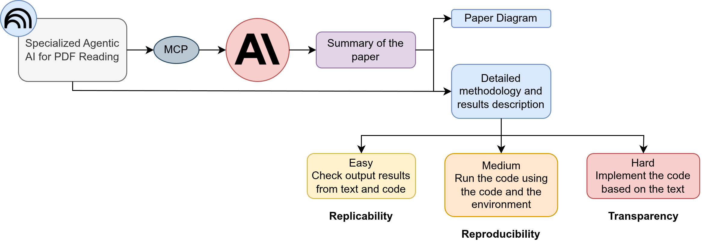
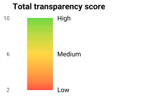

## Why Does This Matter?

Science advances through **confirmation** and **self-correction**.

When a scientific effort fails to independently confirm prior results, it can signal either:

- A **lack of rigor** in the original study, or
- An important **precursor to new discovery**

Understanding these concepts helps us design better research and evaluate existing work.

::: {.callout-note appearance="minimal"}
Report: *Reproducibility and Replicability in Science* [@nasem2019reproducibility]
:::

## Three Distinct Concepts

:::{.r-fit-text}

| | **Reproducibility** | **Replicability** | **Transparency / Rigor** |
|---|---|---|---|
| **Core question** | Same data + same code → same results? | New data + similar methods → consistent results? | Is the process fully documented and well-designed? |
| **Focus** | Computational verification | Scientific consistency | Research quality & openness |
| **Scope** | Single study (code & data) | Across studies | Entire research lifecycle |

:::

&nbsp;

### Reproducibility

:::{.columns}

:::{.column width="70%"}

**What it involves:**

- Re-running the original analysis pipeline
- Using the same data, software, and parameters
- Verifying that outputs match the reported results

:::

:::{.column width="30%"}

**Key enablers:** shared code, open data, containers (Docker), computational notebooks, version control

:::

:::

## Three Distinct Concepts {.smaller}

:::{.columns}

:::{.column width="50%"}

### Replicability

> Obtaining **consistent results** across studies aimed at answering the **same scientific question**, each with its **own data**.

**What it involves:**

- Independent data collection
- Similar (not identical) methods
- Testing whether findings hold across contexts

**Important nuance:** Even rigorous, well-conducted studies may fail to replicate — this is sometimes informative, not necessarily a failure.

:::

:::{.column width="50%"}

### Transparency & Rigor

**Rigor** = strict application of the scientific method to ensure robust, unbiased experimental design, methodology, analysis, and reporting.

**Transparency** = making clear:

- Whether the study was exploratory or confirmatory
- How data was collected and prepared
- Which analyses were planned vs. post-hoc
- The level of uncertainty in results

:::

:::

## How They Relate

::: {style="display: flex; justify-content: center; transform: scale(2.5); transform-origin: center center;"}

```{mermaid}
%%{init: {'theme': 'default', 'themeVariables': {'fontSize': '100px'}}}%%

flowchart LR
    T["Transparency<br/>& Rigor"] -->|enables| R["Reproducibility"]
    T -->|enables| RE["Replicability"]
    R -->|"desired<br/>step"| RE
    RE -->|"builds"| C["Scientific<br/>Credibility"]
    R -->|"builds"| C

    style T fill:#B85042,color:white,font-weight:bold
    style R fill:#065A82,color:white,font-weight:bold
    style RE fill:#2C5F2D,color:white,font-weight:bold
    style C fill:#1E2761,color:white,font-weight:bold
```

:::

- **Transparency & Rigor** underpin everything — without them, neither reproducibility nor replicability is achievable
- **Reproducibility** is the computational baseline — same data, same code, same results
- **Replicability** is the scientific goal — findings that hold across independent studies
- Together, they build **confidence** in scientific knowledge


## Scientific Reproducibility Index {.smaller}

### Agentic AI for Automated Paper Validation

An automated system that **reads**, **extracts**, and **generates code** to validate the reproducibility of scientific papers.

::: {style="text-align: center;"}
{width="50%"}
:::

- **Read**: AI agent ingests the full paper — text, figures, tables, and supplementary materials
- **Extract**: Identifies methodology, datasets, parameters, and expected results
- **Generate Code**: Produces executable reproduction scripts from extracted information
- **Validate**: Runs the code and compares outputs against published results to compute a reproducibility score

::: {.callout-note appearance="minimal"}
Reference: [What is an MCP Server?](https://mcpmarket.com/what-is-an-mcp-server)
:::

## Transparency Score {.smaller}
### A scoring method to assess research transparency

The table shows how transparency is scored by combining result type with data origin:

- **Confirmatory results** that can be verified from both the publication and own data receive the highest score
- **Converging-consistent results** verified only partially receive a medium score
- **Diverging results** that cannot be reproduced from either source receive the lowest score
- The sum of the results consistency based on publication and own data delivers a **total transparency score**

:::{.columns}

:::{.column width="70%"}
<style>
table td:not(:first-child),
table th:not(:first-child) {
  text-align: center;
}
</style>

<div style="display:flex; justify-content:center; align-items:center; height:100%;">
<style>
table td:not(:first-child),
table th:not(:first-child) {
  text-align: center;
}
</style>

<table>
<thead>
<tr>
<th rowspan="2">Results</th>
<th colspan="2">Data origin</th>
<th rowspan="2">Score</th>
</tr>
<tr>
<th>Publication</th>
<th>Own</th>
</tr>
</thead>

<tbody>
<tr>
<td>Confirmatory</td>
<td style="background-color:#32CB00;">Reproducibility</td>
<td style="background-color:#32CB00;">Replicability</td>
<td>5</td>
</tr>

<tr>
<td>Converging-consistent</td>
<td style="background-color:#FFC702;">Partial reproducibility</td>
<td style="background-color:#FFC702;">Partial replicability</td>
<td>3</td>
</tr>

<tr>
<td>Diverging</td>
<td style="background-color:#FE0000;">No reproducibility</td>
<td style="background-color:#FE0000;">No replicability</td>
<td>1</td>
</tr>
</tbody>
</table>
</div>
:::

::: {.column width="30%"}

{width="100%" style="display:block; margin-top:0;"}

:::
:::
   
## Testing the Evaluation Process {.smaller}
### Steps of the Evaluation Process Applied in the Current Stage

* The evaluation process is still under development, therefore in the current presentation it was not possible to apply all the steps 
* Based on the available information it was possible to reproduce the results; **missing information** would mean essentially replication of the results
* The transparency score was not applied at this stage as it requires further development to assess reproducibility and replicability


      
## Evaluating Transparency in Recent Transportation Studies {.smaller}
###  Testing Reproducibility and Replicability in Practice

To assess **practical reproducibility**, we selected two recent transportation studies.

**Selection criteria**

- Access to the **published article**
- Availability of the **underlying dataset**
- Availability of **analysis code** (when possible)

This allows us to evaluate different levels of reproducibility:

- **Data reproducibility** – can results be recreated from the data?
- **Computational reproducibility** – can results be reproduced using the original code?


## The Two Publications {.smaller}

:::{.columns}

:::{.column width="50%"}

#### Study 1 - Revisiting Reproducibility in Transportation Simulation Studies

**Authors:** Kevin Riehl, Anastasios Kouvelas, Michail A. Makridis  
**Journal:** *European Transport Research Review* (2025)  
**DOI:** [10.1186/s12544-025-00718-9](https://doi.org/10.1186/s12544-025-00718-9)

**Available resources**

- Text  
- Dataset  
- Code  

> Reproduced the results by re-writing the code based on the scripts and methodology and using the provided dataset

:::

:::{.column width="50%"}

#### Study 2 - Towards Zero CO~2~ Emissions: Insights from EU Vehicle On-Board Data

**Authors:** Jaime Suarez, Alessandro Tansini, Markos A. Ktistakis, Andres L. Marin, Dimitrios Komnos, Jelica Pavlovic, and Georgios Fontaras  
**Journal:** *Science of the Total Environment* (2025)  
**DOI:** [10.1016/j.scitotenv.2025.180454](https://doi.org/10.1016/j.scitotenv.2025.180454)

**Available resources**

- Text  
- Dataset  

> Attempted to reproduce, but essentially replicated the results by re-writing the code based on methodology and using the provided dataset

:::

:::


## Paper Diagram - 1 {.smaller}
#### Revisiting Reproducibility in Transportation Simulation Studies [@riehlRevisitingReproducibilityTransportation2025]


## Paper Diagram - 2 {.smaller}
#### Towards Zero CO~2~ Emissions: Insights from EU Vehicle On-Board Data [@suarezZeroCO2Emissions2025]

::: {.diagram-scroll}

```{mermaid}
%%{init: {'theme': 'default', 'themeVariables': {'fontSize': '25px'}}}%%
flowchart TD
    %% ── DATA SOURCES ──────────────────────────────────────
    subgraph SOURCES["Data Sources"]
        direction LR
        OBFCM["OBFCM Data<br/>7.7M passenger cars<br/>2021 - 2023"]
        EEA["EEA CO2<br/>Monitoring DB<br/>Full new-vehicle registry"]
        EURO["Eurostat<br/>Population density<br/>Weather / Infrastructure"]
        VEH["Vehicle DBs<br/>Dimensions<br/>Transmission details"]
    end

    %% ── PREPROCESSING ─────────────────────────────────────
    subgraph PREPROC["Preprocessing"]
        MERGE["Merge and Augment<br/>OBFCM + EEA + Eurostat<br/>+ Vehicle databases"]
        DEDUP["Deduplication<br/>Keep most recent<br/>entry per vehicle"]
        OUTLIER["Outlier Filtering<br/>CO2_TA - 30 &lt; CO2_RW &lt; 3 x CO2_TA"]
        FINAL["Final Dataset<br/>7.7M vehicles<br/>31% of total registrations"]

        MERGE --> DEDUP --> OUTLIER --> FINAL
    end

    OBFCM --> MERGE
    EEA --> MERGE
    EURO --> MERGE
    VEH --> MERGE

    %% ── REAL-WORLD CALCULATIONS ───────────────────────────
    subgraph RWCALC["Real-World Calculations"]
        RWFC["RW Fuel Consumption<br/>Lifetime fuel / Lifetime distance"]
        RWCO2["RW CO2 Emissions<br/>RW FC x Fuel conversion factor"]
        EDS["Electric Driving Share<br/>Electric energy / Total energy<br/>PHEVs only"]
        GAP["TA vs RW Gap<br/>Absolute: RW - TA g/km<br/>Relative: percent difference"]

        RWFC --> RWCO2
        RWCO2 --> GAP
        EDS --> GAP
    end

    FINAL --> RWCALC

    %% ── STATISTICAL METHODS ───────────────────────────────
    subgraph STATS["Statistical Modelling"]
        VIF["Variable Selection<br/>VIF &lt; 5 threshold<br/>AIC stepwise selection"]
        PRED["Predictors<br/>Mass / Power / Tyre radius<br/>Fuel / Year / Country<br/>Mileage / EDS"]
        MLR["Multivariable Linear<br/>Regression - MLR<br/>Transparency for policy"]
        LMG["Variance Decomposition<br/>LMG method<br/>R2 attribution per predictor"]

        VIF --> MLR
        PRED --> MLR
        MLR --> LMG
    end

    RWCALC --> STATS

    %% ── KEY RESULTS ───────────────────────────────────────
    subgraph RESULTS["Key Results"]
        direction TB

        subgraph EF["RW Emission Factors - g/km"]
            direction LR
            ICEV["ICEV<br/>Petrol 166 / Diesel 170"]
            HEV["HEV<br/>Petrol 149 / Diesel 190"]
            PHEV["PHEV<br/>Petrol 131 / Diesel 150"]
        end

        subgraph GAPRES["TA vs RW Gap"]
            direction LR
            GAPICV["ICEV and HEV<br/>19 - 20% gap<br/>+25 to +32 g/km"]
            GAPPHV["PHEV<br/>280 - 320% gap<br/>+98 to +117 g/km"]
        end

        subgraph FLEET["Total EU Fleet Emissions"]
            direction LR
            Y21["2021<br/>20.9 Mt"]
            Y22["2022<br/>18.7 Mt"]
            Y23["2023<br/>20.4 Mt"]
        end

        subgraph DRIVERS["Key Variability Drivers"]
            direction LR
            MASS["Vehicle Mass<br/>+15.2 g/km per<br/>100 kg - Petrol"]
            POWER["Engine Power<br/>Primary driver<br/>ICEV and HEV"]
            EDSD["Electric Driving<br/>Share - EDS<br/>51% of PHEV variance"]
        end
    end

    STATS --> RESULTS

    %% ── FLEET ESTIMATION ──────────────────────────────────
    subgraph FLEST["Fleet-Level Estimation"]
        REGMOD["Best Regression Models<br/>Applied to full EEA registry"]
        STOCH["Stochastic Imputation<br/>Mileage + EDS from<br/>OBFCM distributions"]
        AGG["Aggregation<br/>CO2 = Avg RW x Mileage x N<br/>/ 1e9 to Mt CO2"]

        REGMOD --> STOCH --> AGG
    end

    EEA --> REGMOD
    STATS --> REGMOD

    AGG --> FLEET

    %% ── PHEV INSIGHTS ─────────────────────────────────────
    subgraph PHEVINS["PHEV-Specific Insights"]
        direction LR
        CHARGE["Users charge<br/>less than regs assume"]
        MILES["PHEVs drive farther<br/>15,100 vs 11,600 km/yr"]
        OPTRANGE["Optimal range<br/>~70 km electric<br/>yields ~100 g/km"]
    end

    GAPPHV --> PHEVINS

    %% ── STYLES ────────────────────────────────────────────
    classDef source fill:#87CEEB,stroke:#333,stroke-width:2px,color:#00008B
    classDef preproc fill:#90EE90,stroke:#333,stroke-width:2px,color:#006400
    classDef calc fill:#FFFACD,stroke:#333,stroke-width:2px,color:#333
    classDef stats fill:#DDA0DD,stroke:#333,stroke-width:2px,color:#4B0082
    classDef result fill:#FFD700,stroke:#333,stroke-width:2px,color:#333
    classDef gap fill:#FFB6C1,stroke:#DC143C,stroke-width:2px,color:#333
    classDef fleet fill:#98FB98,stroke:#2E7D32,stroke-width:2px,color:#006400
    classDef phev fill:#B0E0E6,stroke:#4682B4,stroke-width:2px,color:#00008B
    classDef driver fill:#FFDAB9,stroke:#FF8C00,stroke-width:2px,color:#333

    class OBFCM,EEA,EURO,VEH source
    class MERGE,DEDUP,OUTLIER,FINAL preproc
    class RWFC,RWCO2,EDS,GAP calc
    class MLR,VIF,LMG,PRED stats
    class ICEV,HEV,PHEV,EF result
    class GAPICV,GAPPHV gap
    class Y21,Y22,Y23,REGMOD,STOCH,AGG fleet
    class CHARGE,MILES,OPTRANGE phev
    class MASS,POWER,EDSD driver

```

:::

## Comparison of Results {.smaller}
### Key Parameters Comparison between Publication and Evaluation

:::{.columns}

:::{.column width="50%"}

#### Study 1 - Revisiting Reproducibility in Transportation Simulation Studies

✔️ **Trustworthiness:** Checked output results from text and code <br>
✔️ **Reproducibility:** Ran the code - did not use the environment <br>
✔️ **Transparency:** Re-created the code based on text and scripts <br>


:::

:::{.column width="50%"}

#### Study 2 - Towards Zero CO~2~ Emissions: Insights from EU Vehicle On-Board Data

✔️ **Trustworthiness:** Checked output results from text and code <br>
❌  **Reproducibility:**  No available code to run <br>
✔️ **Transparency:** Re-created the code based on the text; missing details showed divergence in reproducibility <br>


:::

:::


## References {.smaller}

::: {#refs}
:::