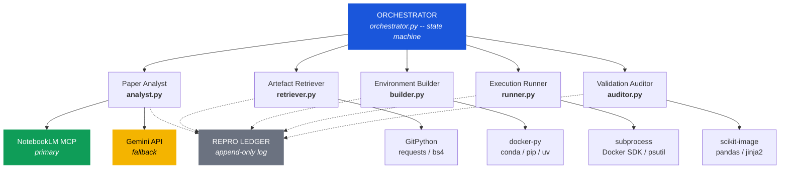
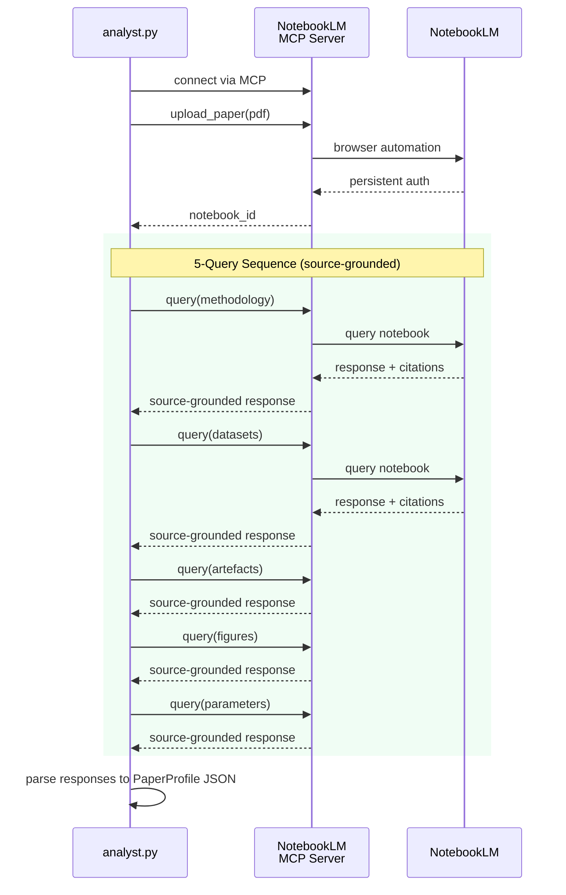
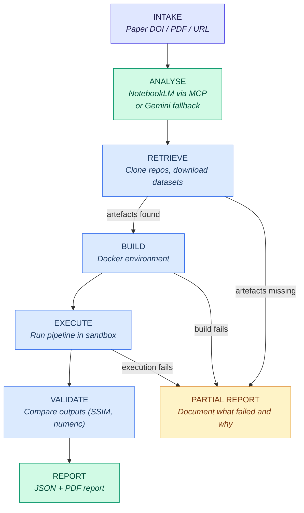
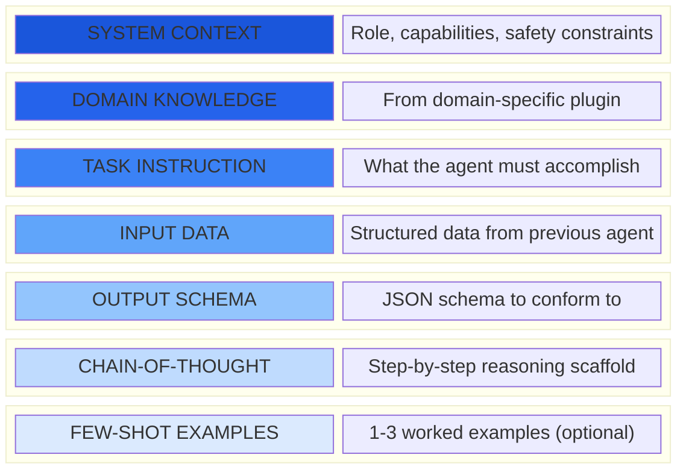

# Agentic AI Architecture for Standardised Research Reproduction

A Python-based pipeline with NotebookLM via MCP for source-grounded paper analysis

<div style="display: flex; justify-content: center;">
<Keywords :keywords="['reproducibility', 'agentic AI', 'NotebookLM', 'MCP', 'open science', 'automation']" />
</div>

---
layout: agenda
---

# Agenda

1. Problem Statement
2. Design Principles
3. System Overview
4. The Five Agents
5. NotebookLM as the Paper Analyst
6. Orchestration and Workflow
7. Reproducibility Scoring Model
8. Data Model
9. Prompt Engineering
10. Failure Modes and Fallbacks
11. Security and Ethics
12. Implementation Roadmap

---
layout: section
---

# 1. Problem Statement

Why automated reproduction matters

---
layout: default
---

# The Reproducibility Crisis in Numbers

Based on Riehl, Kouvelas & Makridis (2025) -- meta-analysis of 46,015 articles from 14 transportation journals (2000-2024).

<br>

| Metric | Value |
|---|---|
| Studies providing a repository | **1.82%** |
| Repositories at Level 5 quality | **12.46%** |
| Researchers citing time as the barrier | **64%** |
| Citation benefit for sharing code | **None (not significant)** |

<br>

<Block type="warning" title="The core problem">
No incentive to share, no time to prepare materials, and no automated way to verify what is shared.
</Block>

---
layout: fact
---

1.82% of transportation simulation studies (2000-2024) provide a code repository

---
layout: statement
---

An automated system that ingests a published paper and systematically attempts to reproduce its results would **audit reproducibility at scale**, **identify specific failure points**, and **generate standardised reports**.

---
layout: section
---

# 2. Design Principles

---
layout: default
---

# Design Principles

| Principle | Rationale |
|---|---|
| **Python-first** | Single package, no protocol overhead, easy to extend |
| **Paper-first** | Input is always a paper (PDF, DOI, URL); everything else is derived |
| **Zero-cost analysis** | NotebookLM via MCP -- source-grounded and free |
| **Deterministic audit trail** | Every action logged to an append-only ledger |
| **Graceful degradation** | Partial reports when full reproduction is impossible |
| **Human-in-the-loop gates** | Untrusted code, large compute, and licensing require approval |
| **Domain-agnostic core** | Domain knowledge lives in plugin modules |

---
layout: section
---

# 3. System Overview

---
layout: default
---

# Architecture



---
layout: default
---

# Package Structure

```python
repro_pipeline/
  __init__.py
  orchestrator.py        # State machine, human-in-the-loop gates
  analyst.py             # Paper analysis via NotebookLM MCP (+ Gemini fallback)
  retriever.py           # Artefact discovery and download
  builder.py             # Environment construction (Docker)
  runner.py              # Sandboxed execution
  auditor.py             # Output comparison and scoring
  schemas.py             # PaperProfile, ArtefactInventory, ReproducibilityReport
  ledger.py              # Append-only reproducibility log
  notebooklm_client.py   # MCP client for NotebookLM server
  prompts/               # Versioned prompt templates
    analyst_queries_v1.md
    analyst_fallback_v1.md
    retriever_v1.md, builder_v1.md, runner_v1.md, auditor_v1.md
  plugins/               # Domain-specific extensions
    transportation.py, ml.py
```

---
layout: default
---

# Usage

```python
from repro_pipeline import orchestrator

# Full automated pipeline -- single line
report = orchestrator.run("10.1186/s12544-025-00718-9")
```

Or step by step:

```python
from repro_pipeline.analyst import upload_paper, extract_profile
from repro_pipeline.retriever import clone_repo
from repro_pipeline.builder import create_container
from repro_pipeline.runner import run_pipeline
from repro_pipeline.auditor import generate_report

profile = extract_profile("paper.pdf")       # NotebookLM via MCP
artefacts = clone_repo(profile.repository_links[0])
container = create_container(artefacts)
results = run_pipeline(container, profile.methodology_steps)
report = generate_report(results, profile)
```

---
layout: section
---

# 4. The Five Agents

---
layout: default
---

# Agent 1: Paper Analyst

**Module:** `analyst.py` | **Backend:** NotebookLM via MCP (Gemini API fallback)

Extracts a structured `PaperProfile` from a research paper using source-grounded queries.

**Outputs:**
- Methodology steps (ordered)
- Software/tools with versions
- Datasets with URLs/identifiers
- Figures and tables to reproduce
- Parameters and hyperparameters
- Repository links
- Hardware requirements

<Block type="info" title="Why NotebookLM?">
Source grounding ensures zero hallucinated tools, datasets, or versions. Every extracted field traces back to a specific passage in the paper.
</Block>

---
layout: default
---

# Agent 2: Artefact Retriever

**Module:** `retriever.py`

Locates, downloads, and validates all artefacts needed for reproduction.

**Decision logic:**
1. Verify repository links and clone accessible repos
2. Search Zenodo, Figshare, Dryad, Google Dataset Search, Papers With Code
3. Score each artefact on the 5-level quality scale (Riehl et al., 2025)
4. Flag licensing conflicts

**Outputs:** `ArtefactInventory` with commit hashes, checksums, licence info, and file structure analysis.

---
layout: two-cols
---

# Agent 3: Environment Builder

**Module:** `builder.py`

Constructs an isolated Docker container from the retrieved artefacts.

1. Detect dependency files
2. Direct installation attempt
3. Infer from import statements
4. Resolve version conflicts
5. Build Docker/OCI container
6. Smoke tests
7. Progressive relaxation if build fails

::right::

# Agent 4: Execution Runner

**Module:** `runner.py`

Runs the pipeline inside a sandboxed container.

1. Determine execution order
2. Execute sequentially
3. Auto-fix common errors
4. Capture all outputs
5. Enforce resource limits
6. Log to reproducibility ledger

**Safety:** No network, no host filesystem, strict memory/time limits.

---
layout: default
---

# Agent 5: Validation Auditor

**Module:** `auditor.py`

Compares reproduced outputs against published results using quantitative metrics.

| Output Type | Metric | Threshold |
|---|---|---|
| Figures | SSIM (Structural Similarity) | >= 0.85 reproduced |
| Figures | Perceptual hash distance | <= 10 |
| Tables | Per-cell relative error | <= 1% |
| Statistics | p-values | Within one order of magnitude |
| Statistics | Coefficients | Within 5% relative error |
| Statistics | R-squared | Within 0.02 absolute |

**Classification:** Reproduced / Partially Reproduced / Not Reproduced / Not Attempted

**Output:** Transparency score *(For more information check general slides)*

---
layout: section
---

# 5. NotebookLM as the Paper Analyst

The key architectural decision

---
layout: compare
leftLabel: "NotebookLM via MCP"
rightLabel: "General-purpose LLM"
leftColor: "green"
rightColor: "red"
---

<div>

- Source-grounded: answers only from the paper
- Citation-backed: traces to specific passages
- Zero cost: no API budget needed
- Low hallucination risk
- Connected via MCP server

</div>

::right::

<div>

- Can hallucinate tools, versions, datasets
- No source traceability
- API costs per paper analysed
- Higher hallucination risk
- Requires prompt engineering to constrain

</div>

---
layout: default
---

# How NotebookLM Integration Works



---
layout: default
---

# The 5-Query Sequence

| # | Query Target | What it Extracts |
|---|---|---|
| 1 | **Methodology** | Steps in order, tools, versions, inputs, outputs |
| 2 | **Datasets** | Names, URLs, descriptions, sizes, licences, availability |
| 3 | **Artefacts** | Repository links, supplementary materials, code references |
| 4 | **Figures/Tables** | Data sources, computations, inputs needed |
| 5 | **Parameters** | Hyperparameters, configuration values, hardware requirements |

<br>

**Confidence scoring from citations:**

| Citation Quality | Confidence |
|---|---|
| Direct quote with section reference | 1.0 |
| Paraphrased with section reference | 0.8 |
| Inferred from context | 0.5 |
| Not found | null |

---
layout: section
---

# 6. Orchestration and Workflow

---
layout: default
---

# State Machine



---
layout: default
---

# Human-in-the-Loop Gates

| Gate | Trigger | Action Required |
|---|---|---|
| `LICENCE_REVIEW` | Non-OSI licence or no licence | Human confirms permission |
| `COMPUTE_APPROVAL` | Runtime > 1h or GPU needed | Human approves resources |
| `CODE_SAFETY` | Network calls, writes outside sandbox, obfuscated code | Human reviews flagged sections |
| `AMBIGUITY_RESOLUTION` | Multiple candidate datasets/repos | Human selects correct artefact |

<br>

<Block type="info" title="Graceful degradation">
If any phase hits a blocking failure, the system transitions to PARTIAL_REPORT rather than halting silently. Every partial report quantifies exactly what failed and why.
</Block>

---
layout: section
---

# 7. Reproducibility Scoring Model

Adapted from the 5-level scale in Riehl et al. (2025)

---
layout: two-cols
---

# Dimension Scores (0-100)

Five dimensions, 20 points each:

| Dimension | Max |
|---|---|
| Artefact Availability | 20 |
| Environment Reproducibility | 20 |
| Execution Success | 20 |
| Output Fidelity | 20 |
| Documentation Quality | 20 |

**Disclaimer:** Precomputed score before transparency.

::right::

# Score Interpretation

| Range | Label |
|---|---|
| 90-100 | Fully Reproducible |
| 70-89 | Largely Reproducible |
| 40-69 | Partially Reproducible |
| 10-39 | Minimally Reproducible |
| 0-9 | Not Reproducible |

<br>

<Block type="info" title="Note">
Low scores may reflect field norms (data privacy, proprietary tools) rather than negligence. Reports include contextual factors alongside scores.
</Block>

---
layout: section
---

# 8. Data Model

---
layout: two-cols
---

# PaperProfile

```json
{
  "doi": "10.1186/...",
  "title": "string",
  "authors": ["string"],
  "methodology_steps": [{
    "order": 1,
    "description": "...",
    "tools_mentioned": [
      "Python 3.9", "pandas"
    ],
    "data_inputs": ["data.csv"],
    "expected_outputs": ["fig1.png"]
  }],
  "datasets": [{
    "name": "string",
    "url": "string | null",
    "licence": "string | null"
  }],
  "repository_links": ["..."],
  "figures_to_reproduce": [{
    "id": "fig_1",
    "type": "bar_chart",
    "data_source": "string"
  }]
}
```

::right::

# ReproducibilityReport

```json
{
  "paper_doi": "string",
  "timestamp": "ISO-8601",
  "overall_score": 78,
  "dimension_scores": {
    "artefact_availability": 18,
    "environment_reproducibility": 15,
    "execution_success": 20,
    "output_fidelity": 12,
    "documentation_quality": 13
  },
  "per_figure_results": [{
    "figure_id": "fig_1",
    "status": "reproduced",
    "ssim_score": 0.92
  }],
  "failure_analysis": [{
    "phase": "VALIDATE",
    "description": "...",
    "severity": "degrading",
    "suggested_fix": "..."
  }],
  "recommendations": ["..."]
}
```

---
layout: section
---

# 9. Prompt Engineering

---
layout: default
---

# Prompt Architecture (for non-analyst agents)



The **Paper Analyst** is different: instead of a monolithic prompt, it uses the **5-query sequence** sent to NotebookLM via MCP, with structured response parsing.

---
layout: default
---

# Prompt Engineering Principles

| Principle | How Applied |
|---|---|
| **Role assignment** | Explicit identity and scope per agent |
| **Tool grounding** | Exact tools listed; NotebookLM prevents hallucinated content |
| **Structured output** | JSON schemas enforce deterministic responses |
| **Chain-of-thought** | Numbered reasoning steps for multi-step logic |
| **Constraint injection** | Safety rules stated before the task |
| **Graceful failure paths** | "If X fails, do Y" logic in every prompt |
| **Confidence scoring** | Agents report certainty levels |
| **Separation of concerns** | One phase per prompt |
| **Domain injection** | Knowledge loaded from plugin modules |

---
layout: section
---

# 10. Failure Modes and Fallback Strategies

---
layout: default
---

# Failure Modes

| Failure | Likelihood | Fallback |
|---|---|---|
| NotebookLM MCP unavailable | Low-Med | Gemini API with PDF upload |
| No machine-readable methodology | High | Infer from prose; flag low confidence |
| Repository link is dead | High | Wayback Machine, GitHub search, author profiles |
| Data "available upon request" | Very High | Log as `UNAVAILABLE_GATED`; synthetic data if possible |
| Dependency version conflicts | Medium | Progressive relaxation: pin -> range -> latest |
| Proprietary software required | Medium | Open-source alternatives; flag for human |
| Stochastic result variance | Medium | Run 5x with different seeds; compare distributions |
| Low-DPI rasterised figures | Medium | Structural comparison; increase tolerance |
| Exceeds resource limits | Low | Scale up with human approval; subset of data |

---
layout: section
---

# 11. Security and Ethics

---
layout: default
---

# Security and Ethical Considerations

<br>

**Code Safety**
- Sandboxed containers: no network, no host filesystem, strict resource limits
- Static analysis (bandit, semgrep) before execution
- No credentials passed into sandbox

**Data Privacy**
- No uploads to external services without consent
- GDPR/copyright: analysis purposes only, not redistribution
- NotebookLM uploads paper to Google's servers -- not suitable for embargoed manuscripts

**Responsible Use**
- Reports are descriptive, not punitive
- Low scores may reflect field norms, not negligence
- Contextual factors reported alongside scores

---
layout: section
---

# 12. Implementation Roadmap

---
layout: timeline
items:
  - year: "Phase 1"
    title: "Core Pipeline (Months 1-3)"
    description: "analyst.py with NotebookLM MCP + Gemini fallback, schemas.py, ledger.py, 5-query sequence design. Evaluate on 10 papers."
  - year: "Phase 2"
    title: "Retrieval and Build (Months 3-5)"
    description: "retriever.py (GitPython, requests), builder.py (docker-py). Evaluate env construction for 20 repositories."
  - year: "Phase 3"
    title: "Execution and Validation (Months 5-7)"
    description: "runner.py (Docker sandbox), auditor.py (SSIM, pandas). End-to-end reproduction of 5 known-reproducible papers."
  - year: "Phase 4"
    title: "Orchestration and Reporting (Months 7-9)"
    description: "orchestrator.py state machine, jinja2 report templates, web dashboard. Run against 50 papers."
  - year: "Phase 5"
    title: "Scale and Community (Months 9-12)"
    description: "Domain plugins, public API, journal integration, community benchmark dataset."
---

---
layout: default
---

# Future: MCP as a Scaling Layer

The analyst module already uses MCP to connect to NotebookLM, proving the pattern works.

If the system grows into a **community platform**, the remaining modules can also be wrapped as MCP servers:

- **Language-agnostic integration** -- plugins in R, Julia, or Rust via MCP
- **Distributed execution** -- agents on different machines via HTTP/SSE
- **Tool discovery** -- new capabilities registered dynamically
- **Composability** -- external tools (Claude Code, Cursor) invoke pipeline stages as MCP tools

<br>

<Block type="info" title="Migration path">
Each module's public functions become MCP tool definitions. schemas.py dataclasses become MCP resource schemas. The orchestrator switches from function calls to tools/call messages. No agent logic or prompt changes required.
</Block>

---
layout: end
thankYou: "Thank You!"
subtitle: "Questions?"
---
