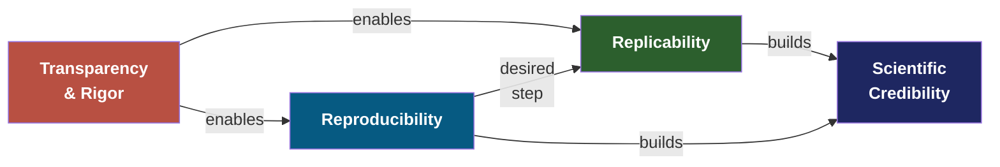
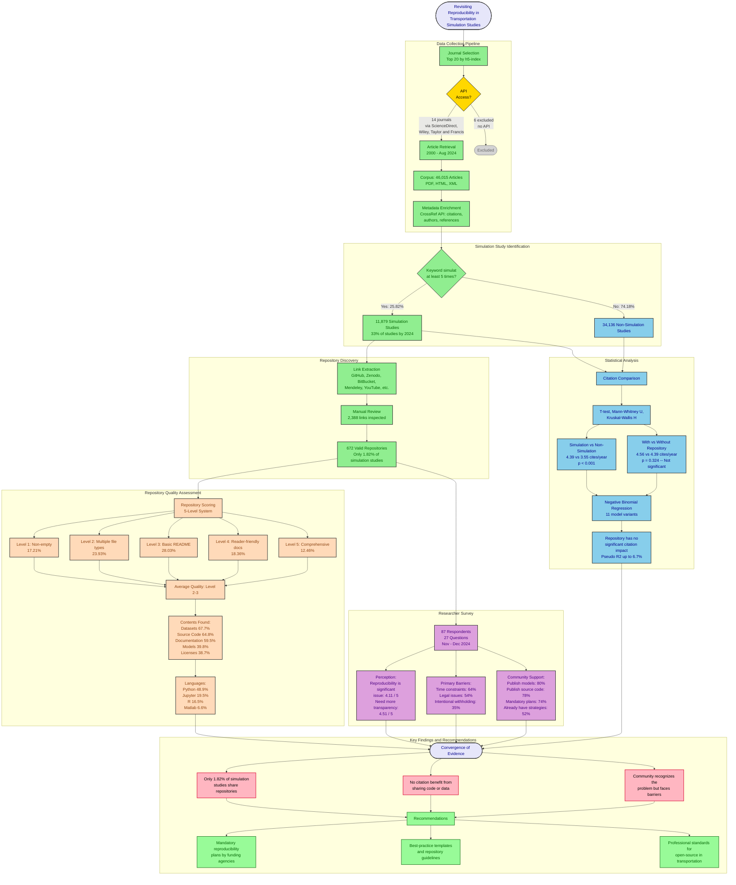
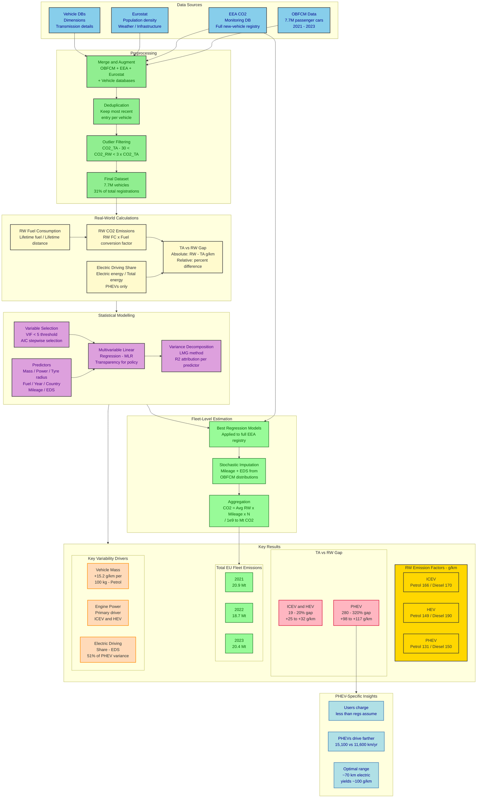
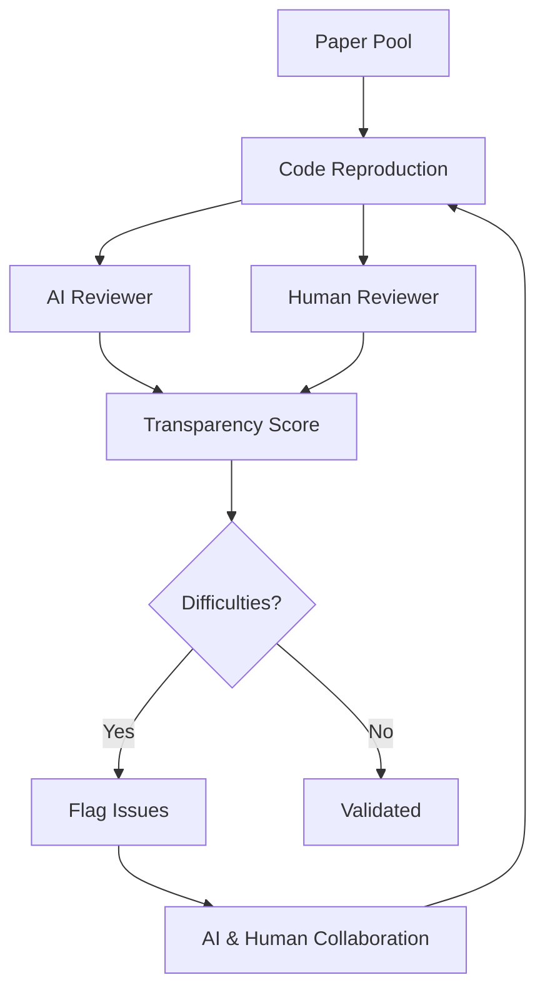

# Publications in 21st Century

Evaluating Reproducibility of Scientific Research

<Keywords :keywords="['reproducibility', 'replicability', 'transparency', 'open science', 'transportation']" />

---
layout: section

---

# Transparency in Science in the 21st Century

---
layout: default

---

# Why Does This Matter?

Science advances through **confirmation** and **self-correction**.

When a scientific effort fails to independently confirm prior results, it can signal either:

- A **lack of rigor** in the original study, or
- An important **precursor to new discovery**

Understanding these concepts helps us design better research and evaluate existing work.

<Block type="info" title="Reference">
Report: Reproducibility and Replicability in Science (NASEM, 2019)
</Block>

---
layout: default

---

# Three Distinct Concepts

|  | **Transparency / Rigor** | **Reproducibility** | **Replicability** |
|---|---|---|---|
| **Core question** | Is the process fully documented and well-designed? | Same data + same code = same results? | New data + similar methods = consistent results? |
| **Focus** | Research quality & openness | Computational verification | Scientific consistency |
| **Scope** | Entire research lifecycle | Single study (code & data) | Across studies |

 

### Transparency & Rigor

**Transparency** = making clear: whether the study was exploratory or confirmatory, how data was collected and prepared, which analyses were planned vs. post-hoc, and the level of uncertainty in results.

**Rigor** = strict application of the scientific method to ensure robust, unbiased experimental design, methodology, analysis, and reporting.

---
layout: two-cols

---

# Three Distinct Concepts

### Reproducibility

> Obtaining **same results** by running the **same code** over **same data** as provided by the **study's authors**

**What it involves:**

- Re-running the original analysis pipeline
- Using the same data, software, and parameters
- Verifying that outputs match the reported results

**Key enablers:** shared code, open data, containers (Docker), computational notebooks, version control

::right::

### Replicability

> Obtaining **consistent results** across studies aimed at answering the **same scientific question**, each with its **own data**.

**What it involves:**

- Independent data collection
- Similar (not identical) methods
- Testing whether findings hold across contexts

**Important nuance:** Even rigorous, well-conducted studies may fail to replicate -- this is sometimes informative, not necessarily a failure.

---
layout: default

---

# How They Relate

- **Transparency & Rigor** underpin everything -- without them, neither reproducibility nor replicability is achievable
- **Reproducibility** is the computational baseline -- same data, same code, same results
- **Replicability** is the scientific goal -- findings that hold across independent studies
- Together, they build **confidence** in scientific knowledge

---
layout: section

---

# AI Application to Evaluate Scientific Research

---
layout: default

---

# Scientific Reproducibility Index

### Agentic AI for Automated Paper Validation

An automated system that **reads**, **extracts**, and **generates code** to validate the reproducibility of scientific papers.

- **Read**: AI agent ingests the full paper -- text, figures, tables, and supplementary materials
- **Extract**: Identifies methodology, datasets, parameters, and expected results
- **Generate Code**: Produces executable reproduction scripts from extracted information
- **Validate**: Runs the code and compares outputs against published results to compute a reproducibility score

> For the first NeurIPS publication, the focus will be on the **Analyst** agent -- the component that reads, extracts, and evaluates paper transparency and reproducibility.

---
layout: default

---

# Transparency Score

### A scoring method to assess research transparency

The table shows how transparency is scored by combining result type with data origin:

- **Confirmatory results** that can be verified from both the publication and own data receive the highest score
- **Converging-consistent results** verified only partially receive a medium score
- **Diverging results** that cannot be reproduced from either source receive the lowest score
- The sum of the results consistency based on publication and own data delivers a **total transparency score**

| Results | Publication | Own | Score |
|---|---|---|---|
| Confirmatory | Reproducibility | Replicability | 5 |
| Converging-consistent | Partial reproducibility | Partial replicability | 3 |
| Diverging | No reproducibility | No replicability | 1 |

*Note: The transparency score is still under development*

---
layout: default

---

# Testing the Evaluation Process

### Steps of the Evaluation Process Applied in the Current Stage

- The evaluation process is still under development, therefore in the current presentation it was not possible to apply all the steps
- Based on the available information it was possible to reproduce the results; **missing information** would mean essentially replication of the results
- The transparency score was not applied at this stage as it requires further development to assess reproducibility and replicability

*Source: Siegel et al., CORE-Bench (2024)*

---
layout: section

---

# Proof of Concept

---
layout: default

---

# Evaluating Transparency in Recent Transportation Studies

### Testing Reproducibility and Replicability in Practice

To assess **practical reproducibility**, we selected two recent transportation studies.

**Selection criteria**

- Access to the **published article**
- Availability of the **underlying dataset**
- Availability of **analysis code** (when possible)

This allows us to evaluate different levels of reproducibility:

- **Data reproducibility** -- can results be recreated from the data?
- **Computational reproducibility** -- can results be reproduced using the original code?

---
layout: two-cols

---

# The Two Publications

#### Study 1 - Revisiting Reproducibility in Transportation Simulation Studies

**Authors:** Kevin Riehl, Anastasios Kouvelas, Michail A. Makridis
**Journal:** *European Transport Research Review* (2025)
**DOI:** 10.1186/s12544-025-00718-9

**Available resources**

- Text
- Dataset
- Code

> Reproduced the results by re-writing the code based on the scripts and methodology and using the provided dataset

::right::

#### Study 2 - Towards Zero CO2 Emissions: Insights from EU Vehicle On-Board Data

**Authors:** Jaime Suarez, Alessandro Tansini, Markos A. Ktistakis, Andres L. Marin, Dimitrios Komnos, Jelica Pavlovic, and Georgios Fontaras
**Journal:** *Science of the Total Environment* (2025)
**DOI:** 10.1016/j.scitotenv.2025.180454

**Available resources**

- Text
- Dataset

> Attempted to reproduce, but essentially replicated the results by re-writing the code based on methodology and using the provided dataset

---
layout: default

---

# Paper Diagram - 1

#### Revisiting Reproducibility in Transportation Simulation Studies

---
layout: default

---

# Paper Diagram - 2

#### Towards Zero CO2 Emissions: Insights from EU Vehicle On-Board Data

---
layout: two-cols

---

# Comparison of Key Parameters

#### Study 1 - Revisiting Reproducibility in Transportation Simulation Studies

**Transparency:** All data were available to conduct the test

**Reproducibility:** Ran the code - did not use the environment

**Replicability:** Checked output results from text and code

::right::

#### Study 2 - Towards Zero CO2 Emissions: Insights from EU Vehicle On-Board Data

**Transparency:** Code was missing and it was not possible to reproduce the results. Replicated from methodology with slight divergences; improvement in the description needed

**Reproducibility:** No available code to run

**Replicability:** Re-created the code based on the text; missing details showed divergence

---
layout: default

---

# Method Evaluation and Benchmarking

### Current State
Manual comparison of our results against published findings, assessing both numerical accuracy and reporting transparency.

### Goal
A scalable, automated benchmarking pipeline across a large paper pool -- with both AI and human reviewers reproducing code and results independently.

---
layout: section

---

# Conclusion & Next Steps

---
layout: two-cols

---

# Ideas and Next Steps

### Next steps

- Develop fully the transparency scoring
- Expand the work on more papers
- Streamline and automate the process
- Benchmark the approach:
  - Compare the AI evaluation with human reviews
  - Identify steps that pose challenges
  - Highlight strengths and weaknesses for each step between AI and humans
- Aim for a submission in NeurIPS -- tentative deadline mid-July 2026

::right::

### Ideas for the Future

Work on the idea of interactive papers that communicate with each other using a machine layer

*Source: Booeshaghi et al. (2026)*

---
layout: references
title: References

---

1. National Academies of Sciences, Engineering, and Medicine. *Reproducibility and Replicability in Science*. Washington, DC: The National Academies Press, 2019.
2. Riehl, K., Kouvelas, A., & Makridis, M. A. "Revisiting Reproducibility in Transportation Simulation Studies." *European Transport Research Review*, 2025.
3. Siegel, N. et al. "CORE-Bench: Fostering the Credibility of Published Research Through a Computational Reproducibility Agent Benchmark." *NeurIPS*, 2024.
4. Suarez, J. et al. "Towards Zero CO2 Emissions: Insights from EU Vehicle On-Board Data." *Science of the Total Environment*, 2025.
5. Booeshaghi, A. S. et al. "Science Should Be Machine-Readable." *Nature*, 2026.

---
layout: end
thankYou: "Thank You!"
subtitle: "Questions?"
email: Andres.LAVERDE-MARIN@ec.europa.eu
---
