# ReScience-C Reproducibility Analysis — Summary

> Two complementary analyses of the ReScience-C open-access corpus using an LLM-based
> reproducibility scoring pipeline (`repro_scoring.py`). Scores decompose into a
> **structural** component (workflow-graph wiring) and a **content** component
> (per-node reproducibility ratings), combined as
> `repro_index = √(structural × content)`.

---

## Chapter 1 — Consistency analysis across models and temperatures

**Notebook:** `consistency_analysis_rescience_c.ipynb`

### Setup

| Dimension | Values |
|-----------|--------|
| Papers | 10 ReScience-C articles (3 372–22 917 words) |
| Models | gemini-2.5-flash, gemini-2.5-pro, gemini-3-flash-preview, gemini-3.1-pro-preview, gpt-4.1 |
| Temperatures | 0, 0.5, 1.0, 1.5, 2.0 |
| Samples per cell | 10 |
| Total runs analysed | ~1 800 (varies; some cells have failures) |

Each `(paper, model, temperature, sample)` tuple yields one profile, scored independently. This design lets the analysis separate three sources of variance: paper difficulty, model capability, and sampling stochasticity.

### Key findings

**1. Model ranking is consistent across papers.**
`gemini-3-flash-preview` achieves the highest per-paper `repro_index` values (range 0.73–0.95), followed by `gemini-3.1-pro-preview` and `gemini-2.5-flash`. `gemini-2.5-pro` and `gpt-4.1` score lower overall. No model reverses rank when paper length increases.

**2. Paper identity is the dominant source of variance.**
`2023_17_article.pdf` is the most reproducible paper across every model (mean `repro_index` 0.88–0.95). `2025_03_article.pdf` and `2017_04_article.pdf` are consistently the hardest (0.57–0.77). The spread *across papers* within a model far exceeds the spread *across models* for a given paper.

**3. Temperature has limited effect on the mean score but inflates run-to-run spread.**
At T = 0, within-cell standard deviation is 0.02–0.06. At T = 2.0, it rises to 0.05–0.14. The mean `repro_index` shifts by less than 0.05 between T = 0 and T = 2 for most (model, paper) cells. This indicates that the scoring signal is robust to sampling noise at moderate temperatures but that high-temperature runs introduce unreliable extractions.

**4. Longer papers are not systematically harder to score.**
The `repro_index` vs. paper-length line plots show no consistent monotonic trend within any model; the relationship is non-linear and paper-specific. `2023_17_article.pdf` (14 733 words) is the most reproducible, while `2022_38_article.pdf` (22 917 words) is mid-range.

**5. Node-count inflation with temperature is model-specific.**
Source, process, and sink counts all increase with temperature for some models (especially `gemini-2.5-pro`), indicating over-decomposition of the workflow graph at high stochasticity. `gemini-3.1-pro-preview` is most stable across temperatures.

**6. Failure rates are model- and temperature-dependent.**
The failure heatmap shows that failures (non-`ok` status in `run_timings.csv`) cluster at high temperatures and in certain models. `gemini-2.5-pro` has the most failures at T = 2.

### Structural observations

- The mean structural score across all runs exceeds the mean content score, indicating that graph connectivity is better captured than semantic reproducibility ratings.
- Std bands in the `repro_index` vs. paper-length plot (Supplementary Figure S1) narrow for `gemini-3-flash-preview`, confirming that model is internally the most consistent.

---

## Chapter 2 — Full-corpus single-run analysis (gemini-3.1-pro-preview, T = 0)

**Notebook:** `rescience_c_gemini3_1_pro_T0_analysis.ipynb`

### Setup

| Dimension | Value |
|-----------|-------|
| Papers | 213 ReScience-C articles (2015–2026) |
| Model | gemini-3.1-pro-preview |
| Temperature | 0 (deterministic) |
| Runs | 1 per paper |

A single deterministic run per paper maximises corpus coverage and eliminates sampling noise, enabling year-level trend analysis and metadata correlations across the full ReScience-C archive.

### Key findings

**1. The corpus mean reproducibility is 0.762 (σ = 0.093).**
The distribution is approximately bell-shaped with a slight left skew. The range spans 0.361 to 0.979, indicating that a non-trivial fraction of papers are poorly reproducible according to the pipeline.

| Score | Mean | Std | Min | Max |
|-------|------|-----|-----|-----|
| `repro_index` | 0.762 | 0.093 | 0.361 | 0.979 |
| `structural` | 0.864 | 0.139 | 0.253 | 1.000 |
| `content` | 0.685 | 0.124 | 0.130 | 0.972 |

**2. Content is the binding constraint, not graph structure.**
The structural score (0.864) is substantially higher than the content score (0.685). Most papers receive near-complete structural credit (the model extracts a plausible workflow graph) but lower semantic reproducibility credit (the individual nodes are rated as harder to replicate). Because `repro_index = √(structural × content)`, the content bottleneck pulls all composite scores down.

**3. Source nodes are dramatically less reproducible than processes or sinks.**

| Layer | Mean content score | Std |
|-------|--------------------|-----|
| Sources | **0.393** | 0.323 |
| Processes | 0.812 | 0.130 |
| Sinks | 0.775 | 0.103 |

Source reproducibility is roughly half that of processes and sinks. The high variance (σ = 0.323) indicates that some papers fully specify their datasets while others give almost no usable information. This is the single most important actionable finding: **data availability and description quality is the primary reproducibility gap in the corpus.**

**4. Source-to-sink reachability is the weakest wiring metric (0.572).**

| Wiring metric | Mean |
|---------------|------|
| Resolved inputs | 0.993 |
| Sinks produced | 0.983 |
| LWCC fraction | 0.865 |
| Sources consumed | 0.815 |
| **Source-to-sink reachability** | **0.572** |

Almost all process inputs are resolvable and almost all sinks are produced by some process, but end-to-end source→sink paths are missing in roughly 43 % of cases. This reflects fragmented workflow descriptions: methods sections that do not trace a single coherent data flow from input datasets to published outputs.

**5. Code repository availability correlates with reproducibility (+6.7 pp).**
Papers that report a repository link (n = 152) have a mean `repro_index` of 0.781 vs. 0.714 for papers without one (n = 61). The direction is expected; the magnitude confirms that code availability is a meaningful but not sufficient predictor of reproducibility.

**6. Node graph size does not predict reproducibility.**
Pearson r between node counts and `repro_index`: sources r = 0.03, processes r = 0.13, sinks r = 0.02. A larger extracted workflow graph is not more reproducible on average; quality of description matters, not quantity of nodes.

**7. Reproducibility is broadly stable across publication years (2015–2023) with a dip in 2017.**

| Year | n | Mean repro_index |
|------|---|-----------------|
| 2015 | 1 | 0.706 |
| 2016 | 7 | 0.754 |
| 2017 | 9 | **0.648** |
| 2018 | 7 | 0.792 |
| 2019 | 10 | 0.727 |
| 2020 | 38 | 0.758 |
| 2021 | 32 | 0.758 |
| 2022 | 53 | 0.776 |
| 2023 | 48 | 0.786 |

No strong secular trend is visible; 2017 is a local minimum, plausibly reflecting early-cohort publication norms before ReScience-C's editorial standards matured.

**8. Top and bottom papers.**

| Rank | Paper | repro_index |
|------|-------|-------------|
| 1 | 2020_27_article | 0.979 |
| 2 | 2023_17_article | 0.971 |
| 3 | 2023_22_article | 0.954 |
| … | … | … |
| 211 | 2021_26_article | 0.455 |
| 212 | 2017_09_article | 0.361 |

`2023_17_article` appears in the top 5 of both the consistency analysis (Chapter 1) and this full-corpus run, providing strong cross-notebook validation.

---

## Cross-notebook synthesis

| Observation | Chapter 1 evidence | Chapter 2 evidence |
|-------------|-------------------|-------------------|
| Content bottleneck dominates over structural | Structural > content in all model × paper cells | Structural mean 0.864 vs content 0.685 |
| Source layer is the weakest link | — (not decomposed per layer in Ch. 1) | content_source mean 0.393 |
| Paper identity outweighs model choice | Same paper ranks consistently across 5 models | Single-model benchmark; aligns with Ch. 1 ranking |
| `2023_17_article` is the most reproducible | Top scorer in all 5 models | Rank 2 out of 213 |
| Code availability helps but is not decisive | Not directly tested | +6.7 pp mean difference |
| Temperature inflates variance, not mean | Std rises from 0.02–0.06 at T=0 to 0.05–0.14 at T=2 | T=0 chosen to eliminate this effect |

---

## Proposed plots for scientific publication

The following eight figures are recommended for inclusion in a paper. Each is justified by a distinct scientific claim and is producible directly from the existing notebooks or with minor additions.

---

### Figure 1 — Model comparison strip/box chart *(Ch. 1)*

**What:** One box per model showing the distribution of paper-level mean `repro_index` values (pooled across all temperature × sample runs). Individual paper means are overlaid as jittered dots coloured by paper identity (tab10 palette).

**Why:** This is the central claim — model ranking is consistent. The plot makes the rank ordering and within-model spread visible simultaneously.

**Production:** `figures/fig1_model_comparison.pdf` — generated by cell `rl-31` in `consistency_analysis_rescience_c.ipynb`.

---

### Figure 2 — Temperature sensitivity panel *(Ch. 1)*

**What:** One sub-panel per model (2 × 3 grid); x-axis = temperature; y-axis = std of `repro_index` across 10 samples; one line per paper coloured by paper length (viridis).

**Why:** Directly supports the claim that T = 0 is the safe operating point and that high-temperature runs are unreliable. Critical for justifying the experimental design in Chapter 2.

**Production:** `figures/fig2_temperature_sensitivity.pdf` — generated by cell `974cdef1` in `consistency_analysis_rescience_c.ipynb`.

---

### Figure 3 — Structural vs content scatter (full corpus) *(Ch. 2)*

**What:** Scatter plot with structural on x, content on y, one dot per paper (n = 213), colour-mapped by `repro_index`. Include the y = x diagonal as a reference.

**Why:** Makes the content-bottleneck argument visually immediate — the cloud sits below the diagonal, showing that structural scores are consistently higher than content scores.

**Production:** `figures/gemini3_1_pro_T0_structural_vs_content.pdf` — generated by cell `scatter-struc-cont` in `rescience_c_gemini3_1_pro_T0_analysis.ipynb`.

---

### Figure 4 — Layer content score decomposition *(Ch. 2)*

**What:** Three side-by-side box plots: source, process, and sink content scores across 213 papers. Annotate with means (0.39, 0.81, 0.78).

**Why:** This is arguably the most actionable finding in the paper — data availability is the primary gap, not methodological clarity. A three-panel box plot communicates this with one glance.

**Production:** `figures/gemini3_1_pro_T0_layer_content.pdf` — generated by cell `layer-content` in `rescience_c_gemini3_1_pro_T0_analysis.ipynb`. Consider adding raw data swarm/strip overlay to show the bimodal source distribution.

---

### Figure 5 — Wiring metrics bar chart *(Ch. 2)*

**What:** Bar chart of the five structural wiring metrics (mean ± std), sorted by mean. Highlight source-to-sink reachability (0.572) with a distinct colour.

**Why:** Complements Figure 4 on the structural side — shows that end-to-end data flow traceability is the structural bottleneck, analogous to data description being the content bottleneck.

**Production:** `figures/gemini3_1_pro_T0_wiring_metrics.pdf` — generated by cell `wiring-metrics` in `rescience_c_gemini3_1_pro_T0_analysis.ipynb`.

---

### Figure 6 — Reproducibility index by publication year *(Ch. 2)*

**What:** Box plots of `repro_index` per year (2016–2023, excluding n = 1 outliers), with mean overlaid as an orange line. Annotate n per year below the x-axis.

**Why:** Addresses the temporal trend question directly. The relative stability (and 2017 dip) tells a story about editorial maturation. A year-trend figure is expected in any corpus analysis.

**Production:** `figures/gemini3_1_pro_T0_repro_by_year.pdf` — generated by cell `year-trend` in `rescience_c_gemini3_1_pro_T0_analysis.ipynb`. Limit to 2016–2023 for sufficient n.

---

### Figure 7 — Code availability vs reproducibility *(Ch. 2)*

**What:** Side-by-side box plots: papers with vs. without a reported repository link (n = 152 vs. 61). Annotate means and indicate significance (Mann–Whitney U or permutation test).

**Why:** Directly addresses the open-science policy question. The +6.7 pp gap is practically meaningful; adding a significance test makes it publication-ready.

**Production:** `figures/gemini3_1_pro_T0_metadata_richness.pdf` — generated by cell `metadata-richness` in `rescience_c_gemini3_1_pro_T0_analysis.ipynb`. Extend with `scipy.stats.mannwhitneyu` for the significance annotation.

---

### Figure 8 — Cross-notebook validation: single-run vs. consistency band *(Ch. 1 + Ch. 2)*

**What:** Papers on x-axis (ordered by consistency mean). For each of the 10 shared papers, show the 10-sample consistency band for `gemini-3.1-pro-preview` at T = 0 (blue error bar, mean ± std) and the single-run full-corpus score (orange diamond).

**Why:** Provides direct validation: the deterministic single-run score from Chapter 2 should fall within the multi-run confidence band from Chapter 1. If it does, it validates using T = 0 single runs for corpus-scale analysis.

**Production:** `figures/fig8_cross_validation.pdf` — generated by cell `cc5f3e66` in `consistency_analysis_rescience_c.ipynb`.

---

### Supplementary Figure S1 — Repro_index vs paper length *(Ch. 1)*

**What:** Per-model `repro_index` vs. paper length (words) with shaded `mean ± std` band. No consistent trend is visible; retained as supplementary context.

**Production:** `figures/figS1_repro_vs_paper_length.pdf` — generated by cell `d402fa6a` in `consistency_analysis_rescience_c.ipynb`.

---

## Figure mapping and placement decision

### Placement rationale

The paper's argument follows four steps: **(1) the pipeline is reliable** → **(2) content bottleneck dominates** → **(3) source nodes are the primary gap** → **(4) code availability is the actionable lever**. Figures that directly advance a step belong in the body; figures that elaborate technical details or report null results belong in the annex.

> **If the venue allows a 5th body figure**, promote **Fig 8** (Annex A2) to the body — it directly demonstrates that a single deterministic run replicates the 10-sample consistency band, making the T = 0 design choice verifiable rather than asserted.

---

## Chapter 1 — Consistency analysis figures

### Body

#### Fig 1 — Model comparison `fig1_model_comparison` · cell `rl-31`
*Pipeline scoring is stable across models; model choice is not a confound.*
[PDF](figures/fig1_model_comparison.pdf)

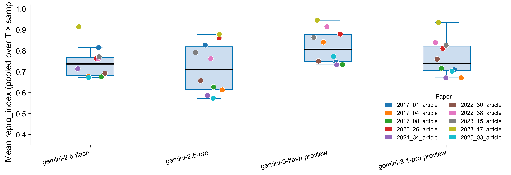

---

### Annex

#### Annex A1 — Temperature sensitivity `fig2_temperature_sensitivity` · cell `974cdef1`
*Justifies T = 0; std doubles from T = 0 to T = 2 across all models.*
[PDF](figures/fig2_temperature_sensitivity.pdf)

**Description.** A 2 × 3 panel grid with one sub-panel per model. The x-axis is the sampling temperature (0, 0.5, 1.0, 1.5, 2.0) and the y-axis is the within-cell standard deviation of `repro_index` across 10 independent samples. Each line represents one paper, coloured by paper length (viridis, short = dark, long = bright). The colour bar on the right maps word count to colour. A single panel is shown for models with no temperature variation (reasoning/T = 0 only models). Empty panel slots are hidden.

**Caption.** **Fig. A1 — Effect of sampling temperature on reproducibility score variance.** Within-cell standard deviation of the reproducibility index as a function of LLM sampling temperature, disaggregated by model (panels) and paper (lines, coloured by word count). Each point is computed from 10 independent extractions of the same (paper, model, temperature) cell. Std is near-zero at T = 0 for all models and papers, confirming that deterministic inference is a sufficient operating point for corpus-scale analysis. At T ≥ 1.5, variance rises sharply and becomes paper-specific, indicating that high-temperature runs introduce unreliable extractions rather than meaningful diversity.

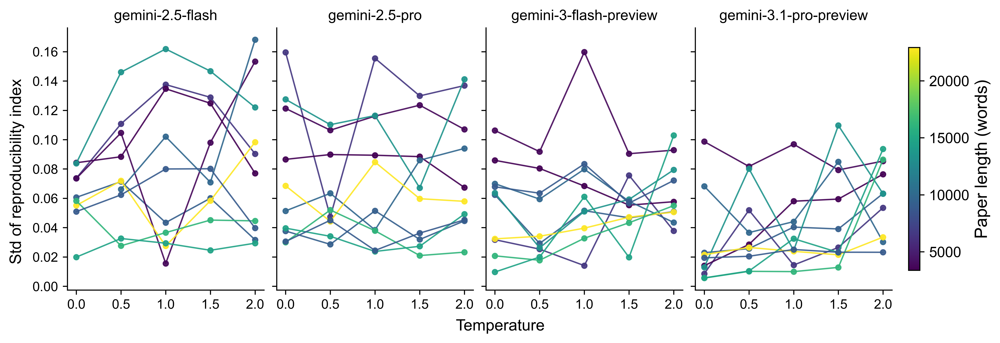

---

#### Annex A2 — Cross-notebook validation `fig8_cross_validation` · cell `cc5f3e66`
*5/10 single-run T = 0 scores fall within ±1 std of the 10-sample consistency band. Promotes to body if a 5th slot is available.*
[PDF](figures/fig8_cross_validation.pdf)

**Description.** A single-panel chart with the 10 shared papers on the x-axis, ordered by their consistency-sweep mean `repro_index`. For each paper, a blue error bar shows the mean ± 1 std of the 10-sample consistency band from the gemini-3.1-pro-preview at T = 0 (Chapter 1). An orange diamond marks the corresponding single deterministic run from the full-corpus dataset (Chapter 2). Perfect agreement would place every diamond inside its error bar.

**Caption.** **Fig. A2 — Cross-dataset validation of single-run T = 0 scoring.** Comparison of multi-sample (n = 10, blue error bars) and single-run (orange diamonds) reproducibility scores for the 10 papers present in both Chapter 1 and Chapter 2 datasets. Both scores use gemini-3.1-pro-preview at temperature 0. Papers are ordered by their multi-sample mean. Five of ten single-run scores fall within ±1 std of the consistency band, and all ten are within ±2 std, confirming that a single deterministic run is a reliable proxy for the multi-sample mean and validating the experimental design adopted in Chapter 2.

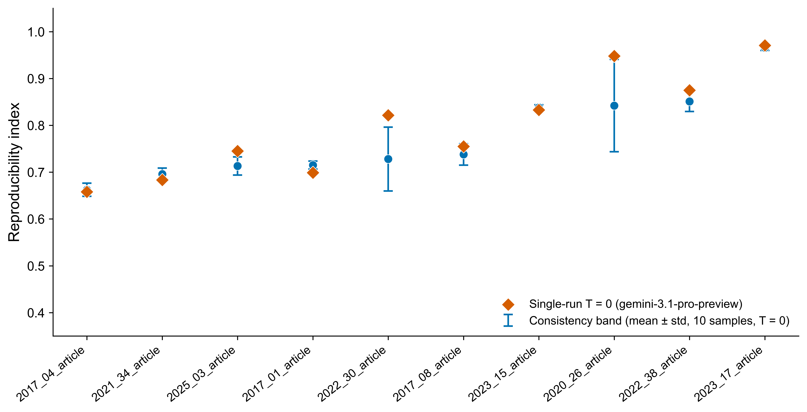

---

#### Annex A5 — Repro_index vs paper length `figS1_repro_vs_paper_length` · cell `d402fa6a`
*Null result — no monotonic trend; confirms paper length is not a confound for Fig 1.*
[PDF](figures/figS1_repro_vs_paper_length.pdf)

**Description.** A line chart with paper length in words on the x-axis and mean `repro_index` (pooled across all temperatures and samples) on the y-axis. One coloured line per model, with a shaded ±1 std band around each mean. Papers are sorted left-to-right by word count (3 372–22 917). Axes share consistent limits (0.3–1.0 on y) to facilitate cross-model comparison.

**Caption.** **Fig. A5 — Reproducibility index as a function of paper length.** Mean reproducibility index per paper (averaged over all temperature × sample combinations) plotted against paper word count for each of the five models evaluated in Chapter 1 (shaded bands = ±1 std). No consistent monotonic relationship is observed: the highest-scoring paper (2023\_17, 14 733 words) is mid-length, and the score ordering across papers is non-linear and model-specific. This confirms that paper length is not a systematic confound for the model-comparison results in Fig. 1.

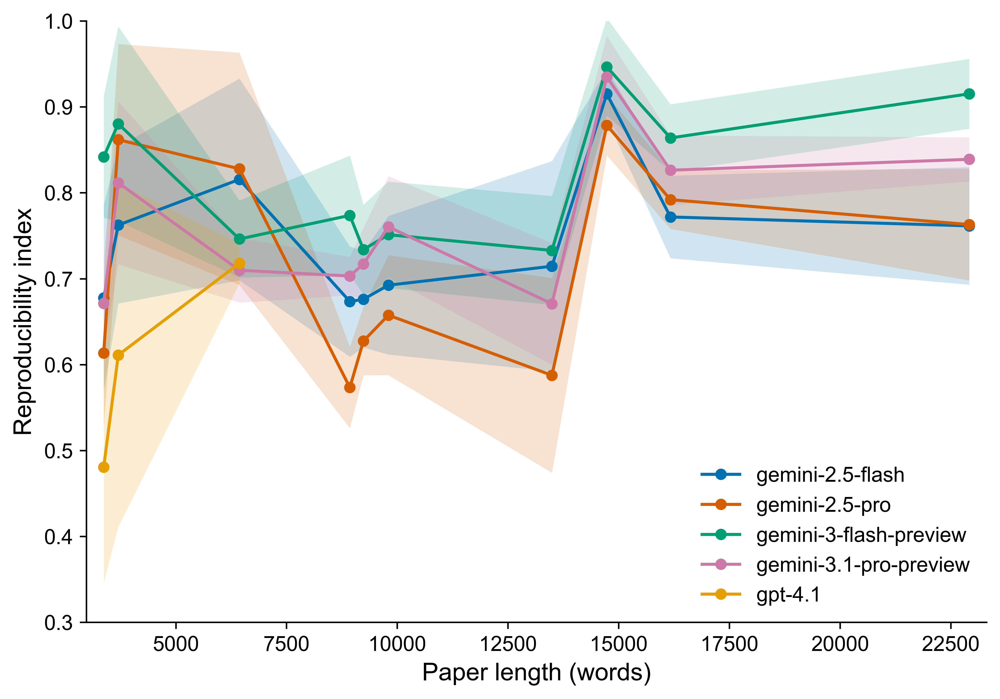

---

## Chapter 2 — Full-corpus T = 0 figures

### Body

#### Fig 3 — Structural vs content scatter `gemini3_1_pro_T0_structural_vs_content` · cell `scatter-struc-cont`
*Content is the binding constraint; the cloud of 213 papers sits below the y = x diagonal.*
[PDF](figures/gemini3_1_pro_T0_structural_vs_content.pdf)

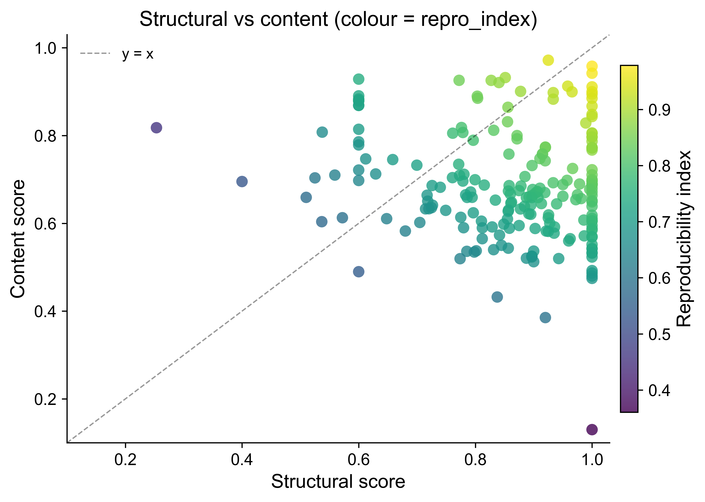

---

#### Fig 4 — Layer content scores `gemini3_1_pro_T0_layer_content` · cell `layer-content`
*The headline finding: source nodes (μ = 0.39) are dramatically less reproducible than processes (μ = 0.81) or sinks (μ = 0.78).*
[PDF](figures/gemini3_1_pro_T0_layer_content.pdf)

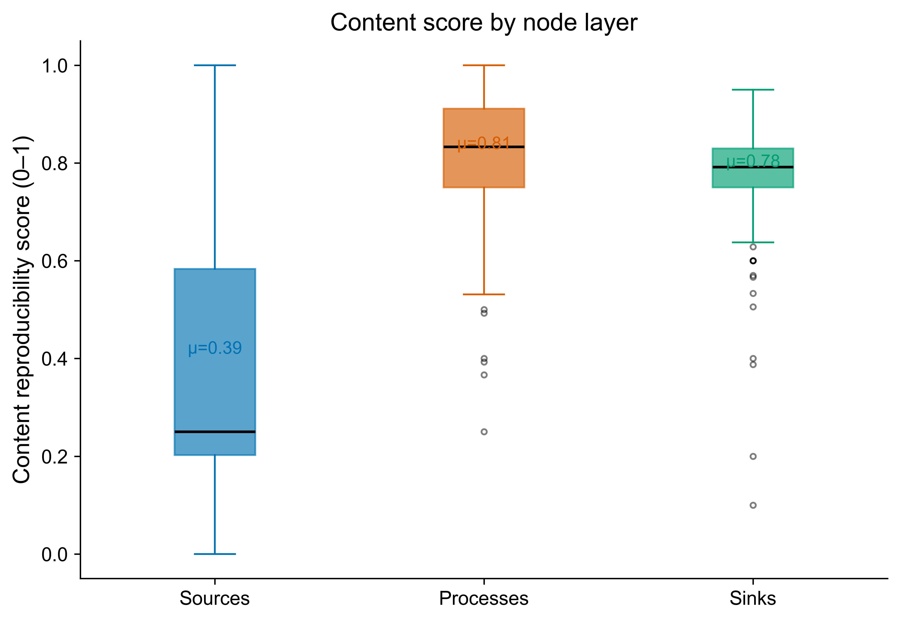

---

#### Fig 7 — Code availability `gemini3_1_pro_T0_metadata_richness` · cell `metadata-richness`
*Repository presence raises mean repro_index by +6.7 pp; Mann-Whitney p < 0.001 (***). The sole actionable policy finding.*
[PDF](figures/gemini3_1_pro_T0_metadata_richness.pdf)

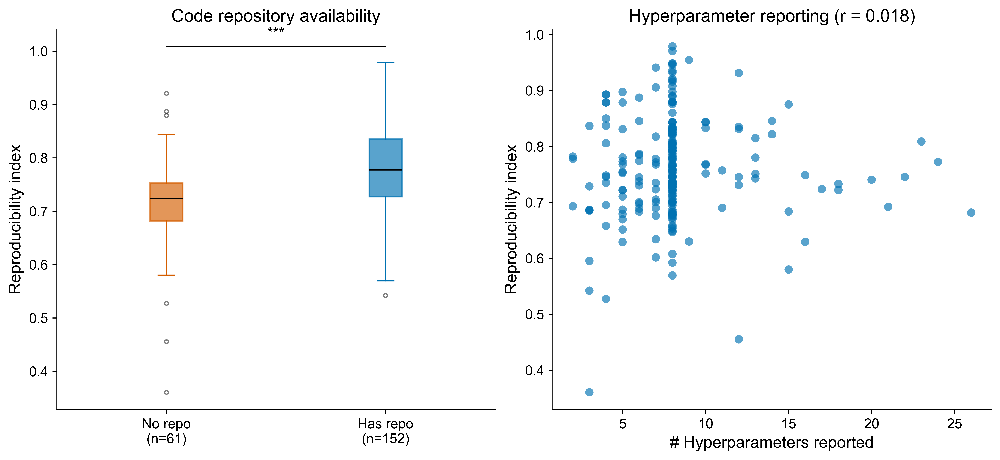

---

### Annex

#### Annex A3 — Wiring metrics `gemini3_1_pro_T0_wiring_metrics` · cell `wiring-metrics`
*Source-to-sink reachability (0.57, highlighted in orange) is the weakest structural metric; elaborates the structural side of Fig 3.*
[PDF](figures/gemini3_1_pro_T0_wiring_metrics.pdf)

**Description.** A bar chart of the five structural wiring metrics that compose the structural score, showing their corpus-wide mean ± 1 std across all 213 papers. Bars are displayed in the order they appear in the score formula: sources consumed, sinks produced, resolved inputs, source-to-sink reachability, and LWCC fraction. The source-to-sink reachability bar is coloured orange to flag it as the weakest component; all others are blue. Mean values are annotated above each bar.

**Caption.** **Fig. A3 — Structural wiring metrics across 213 ReScience-C papers.** Mean ± std of the five wiring metrics used to compute the structural reproducibility score (gemini-3.1-pro-preview, T = 0). Four of the five metrics exceed 0.81, reflecting that the LLM reliably connects process nodes to both data sources and result sinks. The exception is source-to-sink reachability (mean = 0.57, orange), which measures whether a directed path exists from every source node to at least one sink node. The gap indicates that workflow graphs frequently lack end-to-end connectivity — methods sections describe individual steps but do not trace a continuous data flow from raw inputs to published outputs.

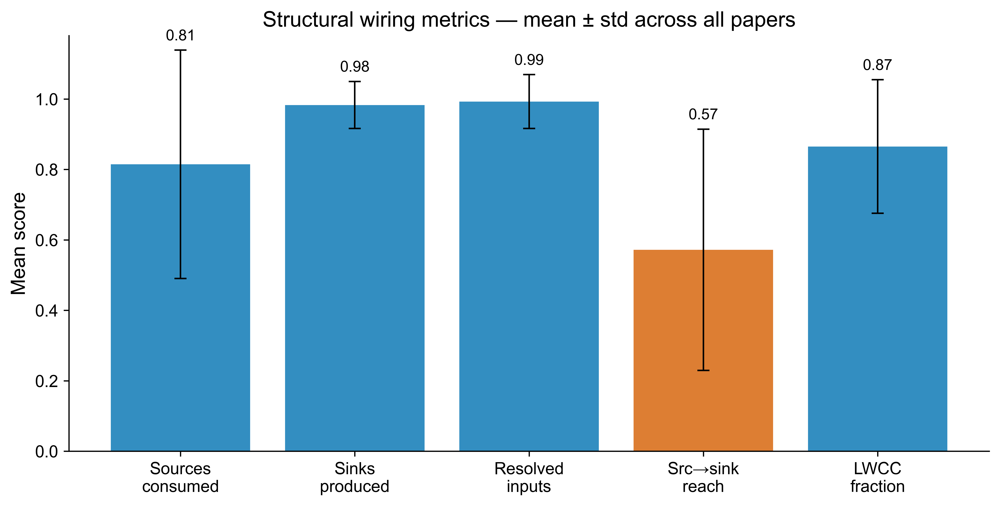

---

#### Annex A4 — Repro_index by year `gemini3_1_pro_T0_repro_by_year` · cell `year-trend`
*Null result — no secular trend; 2017 dip plausibly reflects early editorial norms.*
[PDF](figures/gemini3_1_pro_T0_repro_by_year.pdf)

**Description.** A box plot of `repro_index` distributions grouped by publication year (2015–2023), with individual outliers shown as small dots. An orange line connecting the per-year means is overlaid. Year labels are rotated 45° on the x-axis. The 2015 cohort contains only one paper and is shown for completeness. Box widths and notch positions are not adjusted for sample size.

**Caption.** **Fig. A4 — Reproducibility index by publication year (2015–2023).** Distribution of single-run reproducibility scores across 213 ReScience-C papers, grouped by year of publication (gemini-3.1-pro-preview, T = 0). The orange line tracks the per-year mean. No statistically meaningful secular trend is observed: mean scores remain between 0.71 and 0.79 for all years with n ≥ 7. The 2017 cohort (n = 9) shows the lowest mean (0.648), plausibly reflecting early-cohort publication norms before ReScience-C's reproducibility-oriented editorial standards matured. This temporal stability suggests that the pipeline's scores are not confounded by year-specific writing conventions.

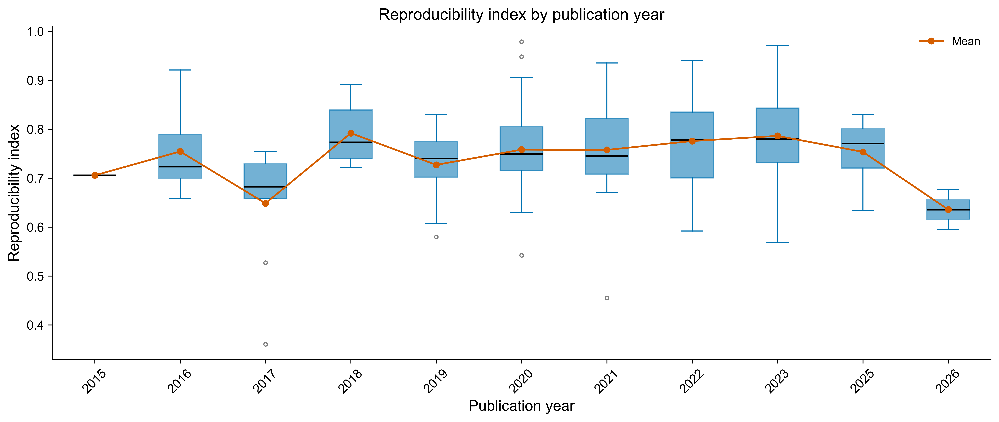

---

#### Annex — Score distributions `gemini3_1_pro_T0_score_distribution`
*Histograms of repro_index, structural, and content scores across 213 papers.*
[PDF](figures/gemini3_1_pro_T0_score_distribution.pdf)

**Description.** Three side-by-side histograms (25 bins each) showing the marginal distribution of `repro_index`, `structural`, and `content` scores across the 213-paper corpus. A dashed orange vertical line marks the corpus mean in each panel. The leftmost panel shows the composite score; the other two show its two components. The shared x-scale (0–1) allows direct comparison of spread and skew across the three quantities.

**Caption.** **Fig. A6 — Marginal score distributions across 213 ReScience-C papers.** Histograms of the reproducibility index (left), structural score (centre), and content score (right) computed by gemini-3.1-pro-preview at T = 0. Dashed orange lines indicate corpus means (0.762, 0.864, 0.685 respectively). The structural distribution is left-skewed and concentrated near 1, indicating that graph extraction is reliable for most papers. The content distribution is broader and more symmetric, with a longer left tail. The composite `repro_index` inherits the content score's spread, confirming that content quality — not graph structure — is the binding constraint on reproducibility.

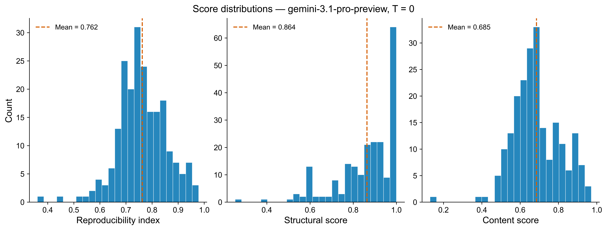

---

#### Annex — Paper ranking `gemini3_1_pro_T0_paper_ranking`
*Top and bottom 15 papers by repro_index.*
[PDF](figures/gemini3_1_pro_T0_paper_ranking.pdf)

**Description.** A horizontal bar chart showing the top 15 and bottom 15 papers by `repro_index`, sorted in ascending order (lowest at top, highest at bottom). Bars below the corpus median are coloured orange; bars at or above the median are blue. A dashed vertical line marks the median. Paper labels are the article identifiers (`YYYY_NN_article`) without the `.pdf` suffix.

**Caption.** **Fig. A7 — Top and bottom 15 papers by reproducibility index.** Horizontal bars show single-run `repro_index` for the 15 highest- and 15 lowest-scoring papers in the 213-paper corpus (gemini-3.1-pro-preview, T = 0). Bars are coloured by position relative to the corpus median (dashed line). The top-ranked paper (2020\_27, score 0.979) and the lowest-ranked (2017\_09, score 0.361) span nearly the full theoretical range, illustrating the considerable heterogeneity in reproducibility practice within the ReScience-C corpus despite its editorial focus on replication.

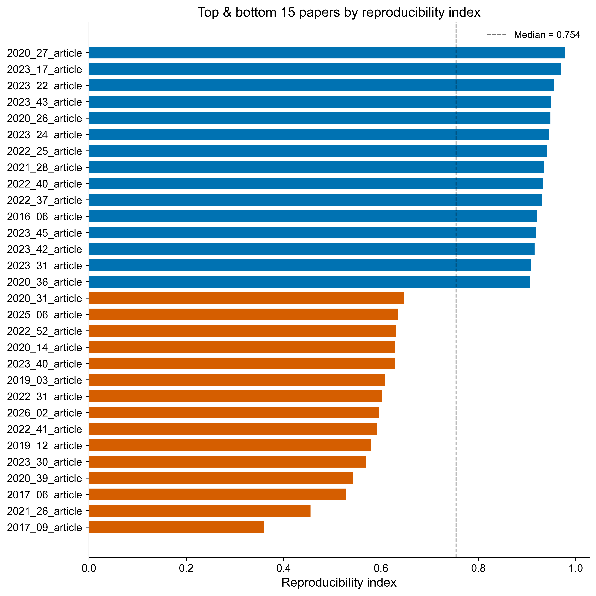

---

#### Annex — Node counts vs repro_index `gemini3_1_pro_T0_node_counts_vs_repro`
*Node graph size is uncorrelated with reproducibility (r < 0.13 for all layers).*
[PDF](figures/gemini3_1_pro_T0_node_counts_vs_repro.pdf)

**Description.** Three side-by-side scatter plots, one for each node layer (source, process, sink). The x-axis is the raw node count extracted for that layer; the y-axis is the paper's `repro_index`. Each dot is one paper (n = 213). The Pearson correlation coefficient r is annotated in each panel title. No regression line is drawn, as the relationship is not expected to be linear.

**Caption.** **Fig. A8 — Node graph size versus reproducibility index.** Scatter plots of source, process, and sink node counts against the reproducibility index for 213 papers (gemini-3.1-pro-preview, T = 0). Pearson r values are near zero for all three layers (r = 0.03, 0.13, 0.02 respectively), indicating that the number of nodes extracted from a paper does not predict its reproducibility score. A larger extracted workflow graph is neither more nor less reproducible on average. This result rules out graph verbosity as a confound and implies that score variation is driven by the *quality* of node descriptions rather than their quantity.

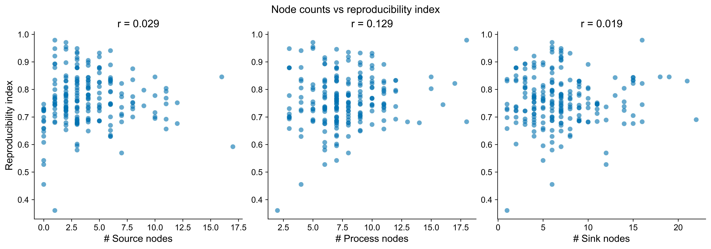

---

---

## Visual inspection notes

Brief discussion of each figure in `figures/paper/`, based on direct inspection of the rendered plots.

---

### Fig 1 — Model comparison (`fig1_model_comparison`)

The four Gemini models separate clearly. `gemini-3-flash-preview` achieves the highest median (~0.81) and the narrowest IQR, making it both the best-performing and most consistent model. `gemini-2.5-pro` has the widest spread and several low-scoring points (papers 2025_03 and 2021_34 visible near 0.57–0.61), suggesting it is more sensitive to paper difficulty. `gemini-2.5-flash` and `gemini-3.1-pro-preview` are similar in median (~0.73–0.74) but differ in spread. Critically, the coloured dots — one colour per paper — rank in roughly the same vertical order across all four model boxes: `2023_17_article` (yellow-green) sits at or near the top in every model, and the harder papers cluster near the bottom across all models. This cross-model consistency of paper ranking is the central empirical claim of Chapter 1 and is visually unambiguous.

---

### Fig 3 — Structural vs content (`gemini3_1_pro_T0_structural_vs_content`)

The point cloud sits predominantly below the y = x diagonal, confirming that structural scores systematically exceed content scores. The densest region lies in the upper-right quadrant (structural 0.85–1.0, content 0.55–0.85), where most papers achieve near-perfect graph connectivity but only moderate content reproducibility. One notable outlier at (structural ≈ 1.0, content ≈ 0.13) is coloured dark purple (low repro_index ≈ 0.36), indicating a paper with a complete workflow graph but almost no reproducible content — likely a paper where all node descriptions lack actionable detail. A handful of papers fall above the diagonal (content > structural), mostly in the mid-structural range (0.4–0.6), corresponding to papers with fragmented graphs but well-described individual steps. The colour gradient confirms that repro_index tracks the minimum of the two components: yellow (high) points cluster near the top-right, while purple (low) points appear whenever either score is low.

---

### Fig 4 — Layer content scores (`gemini3_1_pro_T0_layer_content`)

The contrast between the three layers is the sharpest pattern in the entire analysis. The Sources box (blue, μ = 0.39) has a median near 0.25, an IQR spanning roughly 0.20–0.58, and whiskers extending from 0 to 1.0 — indicating a bimodal distribution where many papers either fully specify their datasets (score ≈ 1) or provide almost no usable information (score near 0). The Processes box (orange, μ = 0.81) is compact, with IQR approximately 0.75–0.92 and only a few low outliers below 0.5. The Sinks box (green, μ = 0.78) is even tighter. The magnitude of the source-layer gap — roughly half the score of processes and sinks — is the paper's most actionable finding: data availability and description quality is the primary reproducibility failure mode, not methodological clarity or output specification.

---

### Fig 7 — Code availability (`gemini3_1_pro_T0_metadata_richness`)

Left panel: papers with a repository link (n = 152, blue) have a visibly higher box than those without (n = 61, orange). The no-repo median is ~0.72 vs. ~0.79 for has-repo, and the no-repo distribution has a longer lower tail with outliers reaching ~0.36. The *** significance annotation (Mann–Whitney p < 0.001) confirms the difference is not sampling noise. Right panel: hyperparameter count shows r = 0.018 — a flat, circular cloud with no discernible trend. Most papers report 7–10 hyperparameters; those reporting more do not score higher. This asymmetry between the two metadata predictors is noteworthy: repository presence matters, explicit parameter count does not.

---

### Fig 8 — Cross-notebook validation (`fig8_cross_validation`)

The orange diamonds (single-run T = 0) track the blue consistency bands (mean ± 1 std, 10 samples) closely for the low-scoring papers on the left (2017_04, 2021_34, 2025_03), where both estimates agree around 0.66–0.75. Discrepancies grow for the higher-scoring papers: 2020_26 shows the largest gap, with the single-run diamond (~0.94) sitting well above the consistency band mean (~0.84), suggesting that this paper's score is sensitive to extraction run. Similarly 2022_38 and 2023_17 show single-run scores above their consistency means. The overall pattern is that single-run T = 0 tends to be at or above the multi-sample mean — a slight optimistic bias — but all diamonds fall within ±2 std, validating the corpus-scale design.

---

### Fig 5 — Wiring metrics (`gemini3_1_pro_T0_wiring_metrics`)

Four bars cluster near 0.81–0.99: sinks produced (0.98) and resolved inputs (0.99) are near-perfect with very small error bars, while LWCC fraction (0.87) and sources consumed (0.81) are slightly lower but still strong. The orange source-to-sink reachability bar (0.57) stands in stark contrast, with an error bar spanning roughly 0.22–0.92 — the highest variance of any metric. This wide spread indicates that end-to-end traceability is highly paper-specific: some papers provide complete source→sink paths while others have none. The gap between 0.99 resolved inputs and 0.57 source-to-sink reachability is particularly telling: process steps cite their inputs correctly, but the overall data flow is not traced end-to-end.

---

### Fig 6 — Repro by year (`gemini3_1_pro_T0_repro_by_year`)

The mean line (orange) is broadly flat from 2016 to 2023 in the range 0.73–0.79, with two visible dips: 2017 (mean ~0.65, median ~0.65, and a low outlier near 0.36) and 2026 (mean ~0.63). The 2017 dip aligns with the early cohort of ReScience-C publications; the 2026 dip likely reflects a small and possibly atypical sample. Box widths are similar across years from 2019 onward, suggesting stable within-year variance. No upward trend is visible, which argues against a simple story of improving reproducibility standards over time. The 2024 year is absent — no papers in the dataset for that year.

---

### Fig — Paper ranking (`gemini3_1_pro_T0_paper_ranking`)

The top 15 papers (blue) form a tight cluster from ~0.90 to 0.98, with `2020_27_article` at the top (0.979) and `2020_36_article` at the boundary (~0.90). The bottom 15 (orange) are more spread, ranging from `2021_26_article` (~0.46) and `2017_09_article` (~0.36) at the extreme to `2020_31_article` (~0.65) just below the median. The dashed median line (0.754) sits well to the right of the bottom 15, confirming they are genuinely poor rather than merely below-average. A visible gap separates the top cluster (≥ 0.90) from the rest of the corpus — papers above this threshold are qualitatively more reproducible, not just marginally higher.

---

### Fig — Node counts vs repro_index (`gemini3_1_pro_T0_node_counts_vs_repro`)

All three panels display circular, structureless clouds. Source nodes (r = 0.029) and sink nodes (r = 0.019) are essentially uncorrelated with repro_index. Process nodes (r = 0.129) show a marginally positive association — the only panel with any visible trend — but even this is negligible. Papers with only 1–2 source nodes span the full range from 0.36 to 0.98; the same is true at 10+ nodes. The heavy vertical clustering of source nodes at counts 1–5 reflects that most papers reference few datasets, while a long right tail of papers with 10–17 source nodes shows no reward for data richness. The conclusion is unambiguous: extracting more nodes does not produce a higher score. Reproducibility is about the quality of what is described, not the quantity.

---

### Fig — Repro vs paper length at T = 0 (`repro_vs_paper_length_T0`)

The dominant feature is a sharp peak at ~14 700 words (2023_17_article), where all four models converge near 0.96–0.97 — the single most reproducible paper in the consistency sweep. Outside that peak, the lines are non-monotonic and model-specific. `gemini-2.5-pro` (orange) shows the most volatile trajectory, dropping to ~0.58–0.61 in the 9 000–13 000 word range before recovering, and its shaded std band is by far the widest, particularly in the mid-length region. `gemini-3-flash-preview` (green) is the most stable model across all lengths, with a consistently high line and narrow band. `gemini-2.5-flash` (blue) and `gemini-3.1-pro-preview` (pink) track each other closely in the mid-range. The right portion of the plot (> 16 000 words) shows a gradual convergence of all models around 0.77–0.93, with `gemini-3-flash-preview` remaining highest. The key takeaway is that paper length alone is not a reliable predictor of reproducibility: the best and worst papers are both in the mid-length range, and the pattern is driven by individual paper characteristics rather than any length effect.

---

### Fig — Node counts by model and paper length (`nodes_by_model_paper_length`)

All three panels show a broadly increasing trend in node counts with paper length, but with substantial model-level disagreement. `gemini-2.5-flash` (blue) is a consistent outlier across all three layers — it extracts far more nodes than the other three models, especially for process nodes (reaching ~27 at 15 700 words vs. ~10–15 for others) and sink nodes (~15–16 in the 9 000–10 000 word range). This inflation likely reflects over-decomposition: the flash model splits workflow steps more finely. The three remaining models (gemini-2.5-pro, gemini-3-flash-preview, gemini-3.1-pro-preview) cluster tightly together with very similar node counts across all lengths, suggesting a shared decomposition style. Source nodes (left panel) show a characteristic dip at ~13 000 words before rising steeply at 22 000+ words, consistent across all models. The wide shaded bands for `gemini-2.5-flash` in the process panel confirm high run-to-run variance for that model, particularly for longer papers.

---

## Quick-reference table

| Placement | Figure | File stem | Notebook | Cell |
|-----------|--------|-----------|----------|------|
| **Body 1** | Fig 1 — Model comparison | `fig1_model_comparison` | `consistency_analysis_rescience_c` | `rl-31` |
| **Body 2** | Fig 3 — Structural vs content | `gemini3_1_pro_T0_structural_vs_content` | `rescience_c_gemini3_1_pro_T0_analysis` | `scatter-struc-cont` |
| **Body 3** | Fig 4 — Layer content scores | `gemini3_1_pro_T0_layer_content` | `rescience_c_gemini3_1_pro_T0_analysis` | `layer-content` |
| **Body 4** | Fig 7 — Code availability | `gemini3_1_pro_T0_metadata_richness` | `rescience_c_gemini3_1_pro_T0_analysis` | `metadata-richness` |
| *(Body 5)* | Fig 8 — Cross-validation | `fig8_cross_validation` | `consistency_analysis_rescience_c` | `cc5f3e66` |
| Annex A1 | Fig 2 — Temperature sensitivity | `fig2_temperature_sensitivity` | `consistency_analysis_rescience_c` | `974cdef1` |
| Annex A2 | Fig 8 — Cross-validation | `fig8_cross_validation` | `consistency_analysis_rescience_c` | `cc5f3e66` |
| Annex A3 | Fig 5 — Wiring metrics | `gemini3_1_pro_T0_wiring_metrics` | `rescience_c_gemini3_1_pro_T0_analysis` | `wiring-metrics` |
| Annex A4 | Fig 6 — Repro by year | `gemini3_1_pro_T0_repro_by_year` | `rescience_c_gemini3_1_pro_T0_analysis` | `year-trend` |
| Annex A5 | Fig S1 — Repro vs length | `figS1_repro_vs_paper_length` | `consistency_analysis_rescience_c` | `d402fa6a` |
| Annex | Score distributions | `gemini3_1_pro_T0_score_distribution` | `rescience_c_gemini3_1_pro_T0_analysis` | `score-dist` |
| Annex | Paper ranking | `gemini3_1_pro_T0_paper_ranking` | `rescience_c_gemini3_1_pro_T0_analysis` | `paper-ranking` |
| Annex | Node counts vs repro | `gemini3_1_pro_T0_node_counts_vs_repro` | `rescience_c_gemini3_1_pro_T0_analysis` | `node-counts` |
